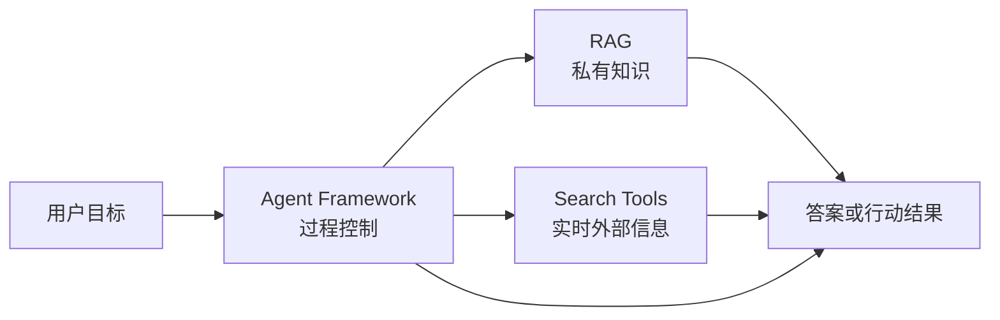

<ChapterLearningGuide />

## 这个专区解决什么问题

很多团队说“我要做一个 Agent”，其实这句话没有工程含义。真正的问题通常是下面三类之一：

```text
Agent Framework
  -> 任务怎么推进，状态怎么保存，工具怎么调用，失败怎么恢复

RAG
  -> 可靠知识怎么进入上下文，权限怎么过滤，引用怎么追溯

Search Tools
  -> 实时外部信息怎么获取，来源怎么筛选，冲突怎么处理
```

这三类能力可以组合，但不能混成一个黑盒。混起来的结果通常是：慢、贵、难调试，出错后不知道是检索错、搜索错、模型错，还是状态机写错。

## 先给结论

| 你的问题 | 优先看什么 | 不要先做什么 |
| --- | --- | --- |
| 只是让模型回答固定问题 | 轻量模型调用 | 不要上复杂 Agent 框架 |
| 要回答内部文档、代码库、制度问题 | [RAG](/agent-selection/03-rag-knowledge-selection) | 不要用开放搜索替代权限知识库 |
| 要回答最新网页、版本、新闻、官方文档 | [搜索工具](/agent-selection/04-search-tools) | 不要把实时网页离线塞进旧索引 |
| 要连续执行多步任务 | [Agent Framework](/agent-selection/01-agent-frameworks) | 不要只靠 Prompt 硬撑流程 |
| 已经确定需要状态图、恢复和人工确认 | [LangGraph](/agent-selection/02-langgraph) | 不要把简单流程画成复杂图 |
| 要内部知识和外部实时信息交叉验证 | [RAG + Search](/agent-selection/05-composition-patterns) | 不要把两类来源混在一个检索器里 |
| 要生产可审计、可恢复、可观测 | [组合方案](/agent-selection/05-composition-patterns) + Trace | 不要上线不可回放的黑盒链路 |

## 三层模型



核心收束句：

```text
RAG 决定知识怎么进来；
Search 决定实时信息怎么进来；
Agent Framework 决定任务怎么推进。
```

## 怎么使用这个专区

不要从框架品牌开始选。先按问题类型收束：

1. 先问是不是只需要一次模型调用。
2. 再问知识来自内部资料、外部实时网页，还是用户当前输入。
3. 最后才问任务是否需要多步状态、工具执行、恢复和审计。

如果答案已经很清楚，可以直接跳到对应文章；如果还不确定，先读基础判断，再按场景进入对应分组。

这个专区分两层阅读：`01-30` 偏决策框架、场景和生产边界，`31-37` 偏组件图谱、工具清单和候选项初筛。不要用工具清单替代系统设计，也不要在系统边界没定清楚时先比较品牌。

## 基础判断

| 文章 | 解决什么 |
| --- | --- |
| [Agent 框架怎么选](/agent-selection/01-agent-frameworks) | 判断是否真的需要 Agent Framework |
| [LangGraph 适合什么场景](/agent-selection/02-langgraph) | 判断状态图、恢复执行和人机确认是否必要 |
| [RAG 知识与检索选型](/agent-selection/03-rag-knowledge-selection) | 判断内部知识、向量库、混合检索和重排 |
| [搜索工具选型](/agent-selection/04-search-tools) | 判断实时外部信息、搜索 API 和网页读取 |
| [组合方案](/agent-selection/05-composition-patterns) | 组合 Agent、RAG、Search、Tools 和 Audit |
| [选型检查表](/agent-selection/06-selection-checklist) | 方案评审前快速收口 |

## 场景化选型

| 文章 | 解决什么 |
| --- | --- |
| [场景选型手册](/agent-selection/07-scenario-playbook) | 用一张表快速映射典型业务场景 |
| [企业 Copilot 技术栈怎么选](/agent-selection/10-enterprise-copilot-stack) | 企业内部助手的权限、工具和审计边界 |
| [代码库 Agent 怎么选](/agent-selection/11-codebase-agent-selection) | 代码问答、代码修改和自动修复 |
| [研究型 Agent 怎么选](/agent-selection/12-research-agent-selection) | Search、Reader、RAG 和引用 |
| [客服和知识库 Agent 怎么选](/agent-selection/13-customer-support-knowledge-agent) | FAQ、客服、转人工和知识治理 |

## 上线评审

| 文章 | 解决什么 |
| --- | --- |
| [POC 与评估标准](/agent-selection/08-poc-evaluation) | 样本集、指标、通过标准和上线缺口 |
| [自研、框架还是托管平台](/agent-selection/09-build-vs-buy) | Build vs Buy 和平台路线 |
| [Agent 选型评审模板](/agent-selection/14-selection-review-template) | 结构化评审任务、权限、评估和风险 |
| [供应商锁定怎么评估](/agent-selection/15-vendor-lock-in) | provider 锁定、迁移和退出成本 |

## 模型与平台

| 文章 | 解决什么 |
| --- | --- |
| [模型路由怎么选](/agent-selection/16-model-routing-selection) | 小模型、大模型、长上下文和 fallback |
| [Agents SDK、Claude Tool Use、LangGraph 怎么取舍](/agent-selection/17-sdk-tools-langgraph) | 平台 SDK、工具调用和状态图边界 |
| [托管 Agent 平台还是自建 Runtime](/agent-selection/18-managed-platform-vs-runtime) | 托管平台、自建控制层和迁移风险 |

## 技术组件选型

这一组是候选清单入口，回答“有哪些具体组件可选”。它不替代前面的系统设计文章；如果你还没确定检索、工具、观测或运行时边界，先看基础判断、RAG 细分和生产工程。

| 文章 | 解决什么 |
| --- | --- |
| [Embedding 模型怎么选](/agent-selection/31-embedding-models) | OpenAI、Cohere、Voyage、BGE、E5、GTE、Jina、Nomic 等模型的场景取舍 |
| [向量数据库怎么选](/agent-selection/32-vector-databases) | Milvus、Qdrant、Pinecone、Weaviate、Chroma、pgvector、ES/OpenSearch 等方案的适用边界 |
| [Hybrid Retrieval 和 Rerank 怎么选](/agent-selection/33-hybrid-retrieval-rerank) | Dense、BM25、Hybrid、Rerank、GraphRAG、Long Context 等检索组件的分工 |
| [Agent 框架组件怎么选](/agent-selection/34-agent-frameworks-landscape) | 自研 loop、LangChain、LangGraph、LlamaIndex、AutoGen、CrewAI、Semantic Kernel、平台 SDK、MCP 和托管 Runtime 的边界 |
| [Reranker 模型怎么选](/agent-selection/35-reranker-models) | Cohere、Voyage、Jina、BGE、ColBERT、LLM-as-reranker 和自训练 Reranker 的场景取舍 |
| [搜索 API、Reader、Crawler、Browser 工具怎么选](/agent-selection/36-search-reader-crawler-browser-tools) | Tavily、Exa、SerpAPI、Jina Reader、Firecrawl、Crawl4AI、Scrapy、Playwright 等工具的分工 |
| [Agent 可观测性和评估工具怎么选](/agent-selection/37-observability-evaluation-tools) | LangSmith、Langfuse、Phoenix、Helicone、Braintrust、Ragas、DeepEval、promptfoo 和 OpenTelemetry 的边界 |

## RAG 细分

这一组更偏 RAG 链路设计，回答“检索系统应该怎样组织”。上面的技术组件文章更偏产品图谱，回答“具体候选方案怎么初筛”。

| 文章 | 解决什么 |
| --- | --- |
| [向量库怎么选](/agent-selection/19-vector-database-selection) | 向量库、metadata filter、多租户和运维 |
| [Hybrid、Rerank、GraphRAG、Long Context 怎么选](/agent-selection/20-retrieval-patterns) | 不同检索增强方案的边界 |
| [企业知识库权限过滤怎么设计](/agent-selection/21-enterprise-knowledge-permission) | 检索前过滤、ACL、脱敏和审计 |
| [代码库 RAG 为什么不能按普通文档做](/agent-selection/22-code-rag-structure) | 文件、符号、调用关系和测试关系 |

## 工具与生产工程

这一组更偏上线边界、权限、审计和故障处理，不负责列全工具生态。需要具体工具候选时，再回到技术组件选型。

| 文章 | 解决什么 |
| --- | --- |
| [MCP 工具怎么选](/agent-selection/23-mcp-tool-selection) | MCP server、工具权限和工具质量 |
| [浏览器自动化、网页抓取、搜索 API 怎么分工](/agent-selection/24-browser-crawl-search) | Search、Reader、Crawler 和 Browser |
| [Text-to-SQL Agent 怎么选型](/agent-selection/25-text-to-sql-agent) | 数据库权限、SQL 审核和审计 |
| [高风险工具执行前的人机确认怎么设计](/agent-selection/26-human-approval) | 审批点、执行边界和回放 |
| [Agent 可观测性怎么选](/agent-selection/27-observability-trace-replay-eval) | Trace、Replay、Eval 和日志指标 |
| [Agent 安全边界与权限模型怎么选](/agent-selection/28-security-permission-selection) | 数据权限、工具权限和 Prompt 注入防线 |
| [成本与延迟怎么纳入选型](/agent-selection/29-cost-latency-selection) | 预算、缓存、并发和模型路由 |
| [Agent 降级策略怎么设计](/agent-selection/30-fallback-strategy) | 重试、fallback、拒答和转人工 |

## 读完之后应该能做什么

你应该能回答五个问题：

- 这个项目是不是必须用 Agent Framework？
- 知识来源应该走 RAG、Search，还是两者组合？
- LangGraph 是必要的状态编排，还是过度设计？
- 方案上线后如何回放、评估、降级和控制成本？
- POC 通过后应该自研、使用框架，还是选择托管平台？
