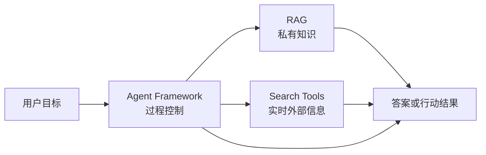

<ChapterLearningGuide />

## 这个专区解决什么问题

这个专区不是泛泛讲 Agent 概念，而是给智能体开发工程师做技术选型用的。每类技术都要回答四个问题：

```text
它解决什么问题？
优点和代价是什么？
什么场景适合用？
什么场景不该用？
```

很多团队说“我要做一个 Agent”，其实这句话没有工程含义。真正的问题通常是下面三类之一：

```text
Agent Framework
  -> 任务怎么推进，状态怎么保存，工具怎么调用，失败怎么恢复

RAG
  -> 可靠知识怎么进入上下文，权限怎么过滤，引用怎么追溯

Search Tools
  -> 实时外部信息怎么获取，来源怎么筛选，冲突怎么处理
```

这三类能力可以组合，但不能混成一个黑盒。混起来的结果通常是：慢、贵、难调试，出错后不知道是检索错、搜索错、模型错，还是状态机写错。

## 先给结论

| 你的问题 | 优先看什么 | 不要先做什么 |
| --- | --- | --- |
| 只是让模型回答固定问题 | 轻量模型调用 | 不要上复杂 Agent 框架 |
| 要回答内部文档、代码库、制度问题 | [RAG](/agent-selection/03-rag-knowledge-selection) | 不要用开放搜索替代权限知识库 |
| 要回答最新网页、版本、新闻、官方文档 | [搜索工具](/agent-selection/04-search-tools) | 不要把实时网页离线塞进旧索引 |
| 要连续执行多步任务 | [Agent Framework](/agent-selection/01-agent-frameworks) | 不要只靠 Prompt 硬撑流程 |
| 已经确定需要状态图、恢复和人工确认 | [LangGraph 与 SDK](/agent-selection/02-langgraph) | 不要把简单流程画成复杂图 |
| 要内部知识和外部实时信息交叉验证 | [RAG 知识与检索选型](/agent-selection/03-rag-knowledge-selection) + [搜索与抓取工具选型](/agent-selection/04-search-tools) | 不要把两类来源混在一个检索器里 |
| 要生产可审计、可恢复、可观测 | [Agent 可观测性与评估怎么选](/agent-selection/21-observability-trace-replay-eval) | 不要上线不可回放的黑盒链路 |

## 三层模型



核心收束句：

```text
RAG 决定知识怎么进来；
Search 决定实时信息怎么进来；
Agent Framework 决定任务怎么推进。
```

## 怎么使用这个专区

不要从框架品牌开始选。先按问题类型收束：

1. 先问是不是只需要一次模型调用。
2. 再问知识来自内部资料、外部实时网页，还是用户当前输入。
3. 最后才问任务是否需要多步状态、工具执行、恢复和审计。

如果答案已经很清楚，可以直接跳到对应文章；如果还不确定，先读基础判断，再按场景进入对应分组。

这个专区分两层：前半部分回答系统边界和业务场景，后半部分回答具体工具和组件怎么选。工具清单必须服务于工程判断，不能只堆品牌名。

## 基础判断

| 文章 | 解决什么 |
| --- | --- |
| [Agent 框架与 Runtime 怎么选](/agent-selection/01-agent-frameworks) | 判断是否需要 Agent Framework，对比自研 loop、LangChain、LangGraph、LlamaIndex、AutoGen、CrewAI、平台 SDK、MCP 和托管 Runtime |
| [LangGraph 与平台 SDK 怎么选](/agent-selection/02-langgraph) | 判断状态图、平台 SDK、Tool Use 和轻量 loop 的取舍 |
| [RAG 链路设计原则](/agent-selection/03-rag-knowledge-selection) | RAG 链路的正确设计顺序：parser、chunk、metadata、检索、重排、权限和评估 |
| [RAG 平台与方案怎么选](/agent-selection/05-rag-platforms) | 判断自建 pipeline、RAGFlow、Dify、GraphRAG 和 Weaviate 的适用边界 |
| [搜索与抓取工具怎么选](/agent-selection/04-search-tools) | 判断 Search API、Reader、Crawler、Browser 和 Scraper 的层级选型 |

## 场景化选型

| 文章 | 解决什么 |
| --- | --- |
| [场景选型手册](/agent-selection/06-scenario-playbook) | 用一张表快速映射典型业务场景 |
| [企业 Copilot 技术栈怎么选](/agent-selection/09-enterprise-copilot-stack) | 企业内部助手的权限、工具和审计边界 |
| [代码库 Agent 怎么选](/agent-selection/10-codebase-agent-selection) | 代码问答、代码修改和自动修复 |
| [研究型 Agent 怎么选](/agent-selection/11-research-agent-selection) | Search、Reader、RAG 和引用 |
| [客服和知识库 Agent 怎么选](/agent-selection/12-customer-support-knowledge-agent) | FAQ、客服、转人工和知识治理 |

## 上线评审

| 文章 | 解决什么 |
| --- | --- |
| [POC 评估与评审](/agent-selection/07-poc-evaluation) | 样本集、指标、通过标准、上线缺口和评审模板 |
| [自研、平台还是托管](/agent-selection/08-build-vs-buy) | Build vs Buy、供应商锁定评估、托管平台 vs 自建 Runtime |

## 模型与平台

| 文章 | 解决什么 |
| --- | --- |
| [模型路由怎么选](/agent-selection/13-model-routing-selection) | 小模型、大模型、长上下文和 fallback |

## 工具与组件选型

这一组是智能体开发工程师最常用的工具选型入口，回答“有哪些具体候选、优点是什么、什么场景适合用、什么场景不该用”。

| 文章 | 解决什么 |
| --- | --- |
| [Embedding 模型怎么选](/agent-selection/14-embedding-models) | OpenAI、Cohere、Voyage、BGE、E5、GTE、Jina、Nomic 等模型的场景取舍 |
| [向量数据库怎么选](/agent-selection/15-vector-database-selection) | Milvus、Qdrant、Pinecone、Weaviate、Chroma、pgvector、ES/OpenSearch 等方案的适用边界 |
| [检索组件怎么选](/agent-selection/16-retrieval-patterns) | Dense、BM25、Hybrid、Rerank、Query Rewrite、GraphRAG、Long Context 等检索组件的分工 |
| [Reranker 模型怎么选](/agent-selection/17-reranker-models) | Cohere、Voyage、Jina、BGE、ColBERT、LLM-as-reranker 和自训练 Reranker 的场景取舍 |

## RAG 细分

这一组更偏 RAG 链路设计，回答“检索系统应该怎样组织”。如果要比较具体 Embedding、向量库和 Reranker 候选，回到工具与组件选型。

| 文章 | 解决什么 |
| --- | --- |
| [企业知识库权限过滤怎么设计](/agent-selection/18-enterprise-knowledge-permission) | 检索前过滤、ACL、脱敏和审计 |

## 生产准入

这一组不是继续堆工具，而是回答“选完技术组合后，什么条件满足才允许进入生产”。核心是可观测、安全、预算和降级。

| 文章 | 解决什么 |
| --- | --- |
| [MCP 工具怎么选](/agent-selection/19-mcp-tool-selection) | MCP server、工具权限和工具质量 |
| [Text-to-SQL Agent 怎么选型](/agent-selection/20-text-to-sql-agent) | 数据库权限、SQL 审核和审计 |
| [Agent 可观测性与评估怎么选](/agent-selection/21-observability-trace-replay-eval) | Trace、Replay、Eval 和日志指标 |
| [Agent 安全边界与权限模型怎么选](/agent-selection/22-security-permission-selection) | 数据权限、工具权限、人机确认和 Prompt 注入防线 |
| [成本与延迟预算检查](/agent-selection/23-cost-latency-selection) | Token、动作、时间预算和超预算处理 |
| [Agent 降级策略怎么设计](/agent-selection/24-fallback-strategy) | 重试、fallback、拒答和转人工 |

## 读完之后应该能做什么

你应该能回答五个问题：

- 这个项目是不是必须用 Agent Framework？
- 知识来源应该走 RAG、Search，还是两者组合？
- LangGraph 是必要的状态编排，还是过度设计？
- 方案上线后如何回放、评估、降级和控制成本？
- POC 通过后应该自研、使用框架，还是选择托管平台？
