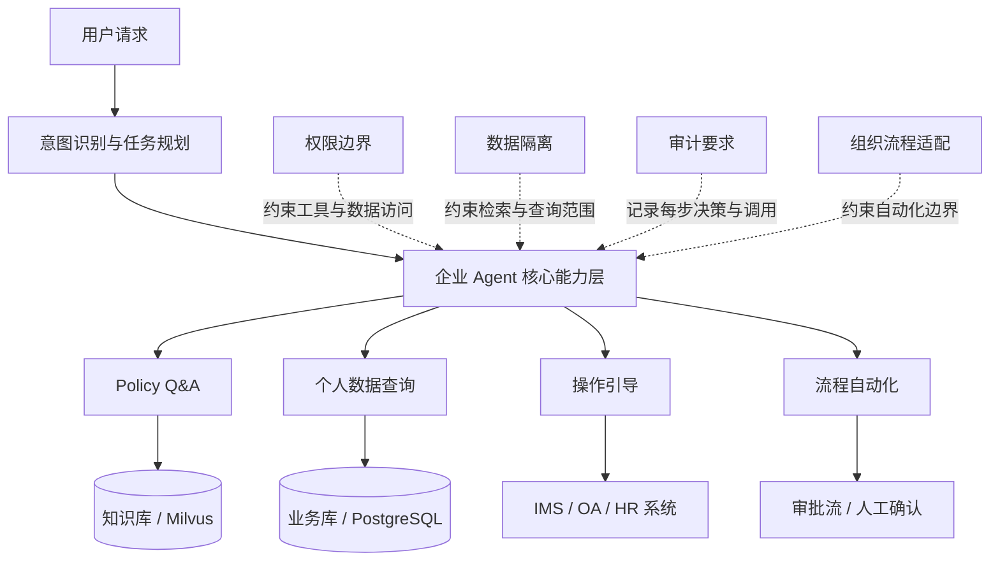

# E00 · 企业 Agent 的四个本质约束

开始之前先问一个问题：你用过 AutoGPT、Dify，或者自己搭过 LangChain Agent 吗？

如果用过，你大概知道这些工具有多强：接一个工具，写一段 Prompt，Agent 就能自主规划、调用、输出。体验非常流畅。

但如果你真的拿这些工具去交付一个企业内部系统，大概率会在上线前碰到四道墙。

## 第一道墙：权限边界

一个开源 Agent 框架默认是“全知”的。它能看到你给它的所有工具、所有数据。但企业里不存在“全知”的用户。

HR 专员能查的数据，财务总监未必能查。普通员工能看自己的绩效，不能看别人的。部门负责人能发起某些流程，普通员工不行。

这不只是“加一个 if 判断”的问题。权限要渗透到每一次工具调用、每一条 SQL、每一个知识库检索。Agent 在规划阶段就得知道“我当前用户能做什么”，而不是执行完了再去拦截。

通用 Agent 框架的默认设计里，通常没有这个层。

## 第二道墙：数据隔离

数据隔离和权限边界紧密相关，但不完全是一回事。

权限边界关注“能不能做”，数据隔离关注“看到什么”。

典型场景是：同样是“查我的考勤记录”，同一套 RAG 索引，用户 A 和用户 B 应该得到完全不同的数据集。如果 Agent 在向量数据库里做相似度检索，检索结果不经过用户维度过滤，就有可能把 A 的数据泄露给 B。即使他们问的是完全相同的问题，结果也必须不同。

这不是假设场景，而是企业 RAG 最常见的线上事故之一。

## 第三道墙：审计要求

企业不只需要 Agent “把事做对”，还需要知道它“为什么这么做”。

合规部门想看：这条操作记录是谁发起的，Agent 调用了哪些工具，查询了哪些数据，生成答案时参考了哪些文档。

这不是“打个日志”就能解决的。Agent 的推理过程是多步的，工具调用可能是异步的。如果没有在设计阶段就把审计链路建进去，事后补几乎不可能做完整。

而且审计数据本身也有权限。HR 的操作记录不能让研发随便看到。

## 第四道墙：组织流程适配

企业里的流程不是你设计的，是历史沉淀的。请假要走 OA，报销要挂发票，入职要签三份表。

Agent 的自动化能力再强，也不能绕过这些流程。它只能嵌入进去。这意味着 Agent 需要理解“当前流程走到哪一步了”“下一步该谁操作”“这一步需不需要人工确认”。

更难的是：同一件事，不同部门、不同层级的审批流可能完全不同。Agent 不能假设流程是固定的。

## 四个约束如何作用到 Agent

这四道墙不是独立的。它们从四个方向同时约束 Agent 的核心能力层。

这不是“上线后再优化”的问题，而是在设计阶段就要把四个维度的约束内化到架构里。

## 为什么开源框架解决不了这个问题

这里有一个认知误区值得专门说一下。

很多团队第一反应是：先用 LangChain 或 Dify 把功能跑通，安全的事后面再加。

这个思路的问题在于：权限和隔离不是“功能”，是“架构属性”。等功能跑通了再加，相当于先建好房子再改地基。

具体来说：

- 权限边界要在 Agent 的规划阶段介入，不是执行阶段拦截。Agent 规划出一个工具调用序列，如果第 3 步调用的工具当前用户没权限，Agent 应该在规划时就感知到，而不是执行到第 3 步才报错。
- 数据隔离要在每一次向量检索和 SQL 查询里附带用户维度的过滤条件，不能依赖结果层的二次过滤。因为 LLM 可能在生成阶段已经“看到”了不该看的数据。
- 审计链路需要在 Agent 的每一步操作里同步写入，而不是事后重建。多步 Agent 的中间状态是短暂的，错过了就丢了。

## IMS Copilot 是怎么面对这四道墙的

在 IMS AI Copilot 的设计里，这四个约束被映射成了四个具体的工程决策：

| 约束 | IMS 的应对策略 |
| --- | --- |
| 权限边界 | 每次工具调用前注入当前用户的角色上下文，工具层做权限校验 |
| 数据隔离 | Milvus 检索时强制附加 `user_id` 过滤，PostgreSQL 查询走行级安全策略 RLS |
| 审计要求 | Agent 每步操作异步写入审计表，包含 `session_id`、`tool_name`、input/output 摘要 |
| 流程适配 | 高风险操作引入 Human-in-the-Loop 节点，Agent 暂停等待人工确认后继续 |

这四个决策不是独立的。它们共同构成了 IMS Copilot 的安全底座。后续每一篇的技术细节，都建立在这个底座上。
