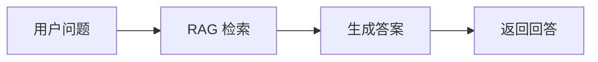
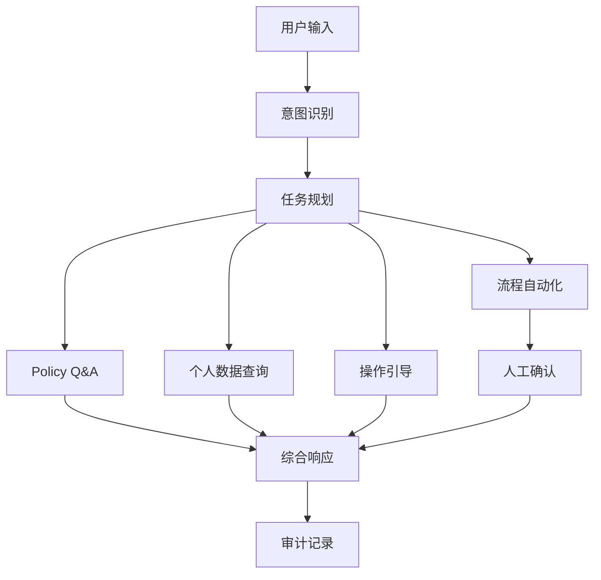

# E01 · 从 Chatbot 到 Enterprise Agent

很多企业做 AI 的第一步，都是先做一个 Chatbot。

这很自然。Chatbot 的边界清楚：用户问一句，系统答一句。接入知识库以后，它能回答制度、流程、FAQ；接入数据库以后，它还能查一些结构化数据。演示效果通常不错。

但 Chatbot 和 Enterprise Agent 之间，有一条非常明确的分水岭：

> Chatbot 的目标是回答问题，Enterprise Agent 的目标是推进业务任务。

这句话看起来简单，但它会改变整个系统设计。

## Chatbot 只需要回答，Agent 必须理解目标

用户问“今年还剩几天年假”，Chatbot 可以把问题路由到假期查询接口，然后返回一个数字。

但用户问“我下周想休三天，可以帮我看看怎么请假吗”，这就不再只是查询问题。

系统至少要理解四件事：

1. 用户想休假的时间范围是什么；
2. 当前用户还剩多少假期额度；
3. 公司的请假政策是否允许这样拆分；
4. 如果条件满足，是否要继续发起请假流程。

这时系统不只是回答“你还有 5 天年假”，而是在围绕“完成请假”这个目标推进。

这就是 Agent 的起点。

## 三种形态的差异

可以先用一张表把边界拉清楚：

| 形态 | 用户输入 | 系统输出 | 核心能力 | 风险 |
| --- | --- | --- | --- | --- |
| Chatbot | 问题 | 答案 | 检索、生成 | 答错 |
| Copilot | 任务意图 | 建议或半自动步骤 | 意图识别、上下文理解 | 建议不完整 |
| Enterprise Agent | 业务目标 | 查询、引导、执行、确认 | 规划、工具调用、流程协同、审计 | 越权、泄露、误操作 |

Chatbot 可以只关心“答案是否准确”。Enterprise Agent 必须关心“动作是否安全、流程是否合规、上下文是否完整”。

这也是为什么 E00 里说，权限、隔离、审计、流程适配不是后加功能，而是地基。

## IMS Copilot 的真实边界

IMS AI Copilot 不是一个“企业知识库问答机器人”。如果只做制度问答，它的架构会简单很多：

但 IMS Copilot 要覆盖四类能力：

- Policy Q&A：回答制度和流程问题；
- 个人数据：查询和当前用户强相关的业务数据；
- 操作引导：告诉用户下一步应该去哪、填什么、注意什么；
- 流程自动化：在用户确认后代为发起或推进流程。

所以它更接近下面这个形态：

这张图里最重要的不是 LLM，而是“意图识别”和“任务规划”。

因为用户不会按系统能力边界提问。用户只会说自己想做什么。

## 用户不会替系统拆任务

企业 Agent 最难的地方在于：用户输入通常是混合的。

例如：

> 我下周想休三天，看看年假够不够，如果够的话告诉我怎么申请。

这句话里至少有三层意图：

| 意图 | 对应能力 |
| --- | --- |
| “下周想休三天” | 提取时间和业务目标 |
| “年假够不够” | 查询个人数据 |
| “怎么申请” | Policy Q&A + 操作引导 |

如果系统把它当成一个普通 RAG 问题，就会只回答请假制度。

如果系统把它当成一个数据库查询，就会只返回假期余额。

如果系统直接发起流程，又会越过用户确认。

企业 Agent 的第一件事，就是把这类混合输入拆成可控的任务单元。

## Enterprise Agent 的最小能力闭环

一个企业 Agent 至少需要五个步骤：

1. 识别用户真正想完成什么；
2. 判断当前用户是否有权限做这件事；
3. 选择需要调用哪些知识、数据或业务系统；
4. 对高风险动作暂停并请求确认；
5. 把每一步选择和调用记录下来。

可以把它压缩成一句话：

> 企业 Agent 是一个带权限、数据边界、审计链路和人机确认的业务任务推进器。

这也是 IMS Copilot 后续设计的基准线。

## 这一篇的结论

不要用“能不能聊天”判断一个企业 Agent。

真正该问的是：

- 它能不能识别业务目标；
- 它能不能拆分混合任务；
- 它能不能在权限和数据边界内调用系统；
- 它能不能在高风险动作前停下来问人；
- 它能不能留下可追踪的审计链路。

如果这些都没有，它只是一个企业 Chatbot。

如果这些都具备，它才开始接近 Enterprise Agent。
