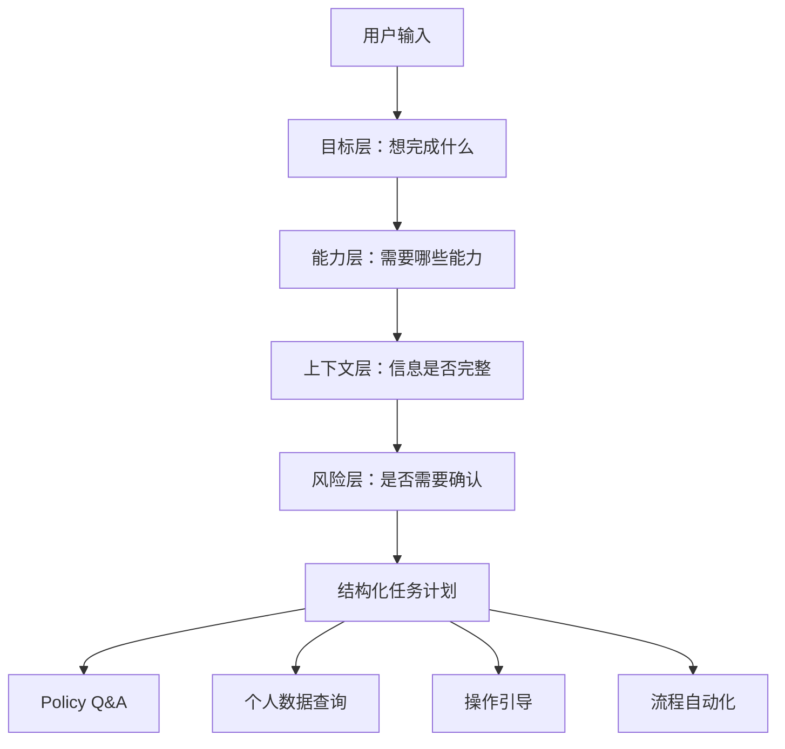

# E02 · 企业 Agent 的意图分层

很多团队做企业 Agent 的第一版，会先写一个意图分类器。

比如把用户输入分成四类：

- policy_qa
- personal_data
- operation_guide
- workflow_automation

这个方向没错，但还不够。

企业 Agent 里的“意图”不是一个标签，而是一组可以驱动后续执行的结构化任务。

## 为什么单标签分类不够

看一个例子：

> 我这个月加班够不够调休？如果够的话，帮我看看怎么申请。

如果只做单标签分类，它可能被分到：

- personal_data：因为要查加班时长；
- policy_qa：因为要判断调休规则；
- operation_guide：因为用户问怎么申请。

三个都对，但只选一个就会丢信息。

企业用户的问题天然会跨能力边界。系统真正需要的不是“它属于哪一类”，而是：

1. 用户要完成什么业务目标；
2. 这个目标需要哪些能力参与；
3. 哪些信息已经具备，哪些信息缺失；
4. 是否涉及高风险动作；
5. 下一步应该查、问、引导还是执行。

这就是意图分层的意义。

## 四层意图模型

IMS Copilot 可以把意图识别拆成四层：

| 层级 | 问题 | 示例输出 |
| --- | --- | --- |
| 目标层 | 用户最终想完成什么 | 申请调休、查询政策、发起报销 |
| 能力层 | 需要哪些系统能力 | Policy Q&A、个人数据、操作引导、流程自动化 |
| 上下文层 | 已知和缺失的信息是什么 | 时间范围、用户身份、流程类型、审批对象 |
| 风险层 | 是否需要拦截或确认 | 只读、低风险写入、高风险流程动作 |

这四层合在一起，才是企业 Agent 可以执行的意图。



## 意图识别应该输出什么

一个更实用的输出不是字符串标签，而是任务草案。

例如用户问：

> 我下周三到周五想请年假，帮我看看能不能请。

意图识别可以输出：

```ts
type IntentDraft = {
  goal: 'check_leave_feasibility'
  capabilities: ['personal_data', 'policy_qa']
  entities: {
    leaveType: 'annual_leave'
    dateRange: {
      start: 'next_wednesday'
      end: 'next_friday'
    }
  }
  missingFields: []
  riskLevel: 'read_only'
  nextAction: 'query_and_reason'
}
```

这里的关键不是 TypeScript 写法，而是结构。

它告诉后续 Planner：这不是单纯问制度，也不是单纯查余额，而是要综合“个人年假余额”和“制度规则”判断是否可行。

## IMS 的四类能力如何映射

IMS Copilot 的四类能力，正好可以作为能力层的基础枚举。

| 能力 | 触发信号 | 常见输出 |
| --- | --- | --- |
| Policy Q&A | “规定是什么”“怎么计算”“需要什么条件” | 带引用的制度解释 |
| 个人数据 | “我的”“这个月”“剩多少”“查一下” | 用户维度过滤后的结构化数据 |
| 操作引导 | “怎么做”“在哪里填”“下一步” | 步骤说明、入口链接、注意事项 |
| 流程自动化 | “帮我提交”“发起”“撤回”“审批” | 工具调用计划、确认节点 |

不要把它们设计成互斥关系。

企业 Agent 真正有价值的地方，通常就在多能力组合处。

## 风险层不能省

意图识别里最容易被忽略的是风险层。

例如：

> 帮我提交请假申请。

这句话不是“流程自动化”四个字就够了。它至少要判断：

- 当前用户是否有发起请假的权限；
- 请假时间、类型、原因是否完整；
- 是否会产生真实业务副作用；
- 是否需要用户确认后再提交。

所以风险层通常可以先粗分：

| 风险等级 | 含义 | 系统动作 |
| --- | --- | --- |
| read_only | 只查询、不改变系统状态 | 可直接执行 |
| guided | 给步骤、不代用户执行 | 返回操作引导 |
| confirm_required | 会写入业务系统 | 执行前请求确认 |
| blocked | 当前用户无权或信息不合法 | 拒绝并说明原因 |

有了风险层，Agent 才知道什么时候可以继续，什么时候必须停下来。

## 意图分层的工程原则

企业 Agent 的意图识别要遵守三个原则：

第一，宁可多输出结构，也不要只输出标签。标签只能路由，结构才能执行。

第二，能力可以组合，不要强行互斥。用户的问题经常同时需要知识、数据和操作引导。

第三，把缺失信息显式暴露出来。缺字段时不要让 LLM 猜，应该进入澄清节点。

这一层做好了，后面的混合查询、Text-to-SQL、Human-in-the-Loop 才有稳定入口。
