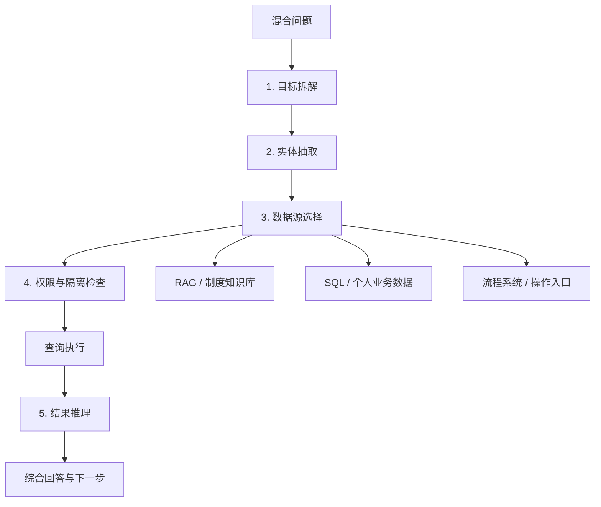

# E03 · 混合查询的拆解策略

企业 Agent 最容易翻车的地方，不是单纯的 RAG，也不是单纯的 SQL，而是混合查询。

所谓混合查询，就是用户一个问题里同时需要：

- 查知识库里的制度；
- 查业务库里的个人数据；
- 结合流程规则做判断；
- 最后给出下一步操作建议。

用户不会说：“请先帮我查 PostgreSQL，再查 Milvus，最后把两个结果做规则推理。”

用户只会说：

> 我这个月加班能不能换调休？如果可以，应该怎么申请？

## 混合查询为什么难

这个问题至少包含三类信息：

| 信息 | 来源 |
| --- | --- |
| 这个月加班时长 | 个人数据 / 考勤系统 |
| 调休规则 | Policy Q&A / 知识库 |
| 申请方式 | 操作引导 / 流程系统 |

如果只走 RAG，系统可能回答制度，但不知道用户实际加班够不够。

如果只走 SQL，系统可能返回加班时长，但不知道调休规则。

如果直接走流程自动化，系统又可能在条件不完整时发起错误流程。

所以混合查询的核心不是“多接几个工具”，而是先把问题拆干净。

## 五步拆解法

一个企业混合查询，可以按五步拆：

1. 目标：用户到底想判断什么；
2. 实体：涉及哪些人、时间、流程、业务对象；
3. 数据源：每个子问题应该查哪里；
4. 权限：当前用户能不能查这些数据；
5. 推理：多个结果之间怎么组合成结论。



这五步的顺序很重要。不要先查，再靠 LLM 总结。企业场景里，先查错数据源就已经可能泄露信息。

## 示例：调休问题怎么拆

用户输入：

> 我这个月加班能不能换调休？如果可以，应该怎么申请？

可以拆成：

| 拆解项 | 结果 |
| --- | --- |
| 目标 | 判断是否满足调休条件，并给出申请路径 |
| 实体 | 当前用户、本月、加班、调休 |
| 数据源 | 考勤系统、调休政策知识库、OA 操作入口 |
| 权限 | 只能查询当前用户自己的考勤记录 |
| 推理 | 加班时长是否达到政策门槛，是否存在过期或部门限制 |

执行上可以分三段：

1. 查询当前用户本月加班时长；
2. 检索调休政策中关于时长、有效期、申请条件的规则；
3. 综合判断后给出“可以 / 不可以 / 还缺什么信息”。

## 数据源选择不能交给模型自由发挥

很多系统会把工具列表直接暴露给 LLM，让模型自己决定查什么。

在企业场景里，这样做风险很高。

更稳的方式是让意图识别输出数据源计划，再由 Planner 校验：

```ts
type QueryPlan = {
  goal: 'check_comp_time_eligibility'
  sources: [
    {
      type: 'personal_data'
      system: 'attendance'
      filters: ['current_user', 'current_month']
    },
    {
      type: 'policy_qa'
      collection: 'leave_policy'
      query: '调休 申请 条件 有效期'
    },
    {
      type: 'operation_guide'
      system: 'oa'
      intent: 'comp_time_application'
    }
  ]
  riskLevel: 'read_only'
}
```

注意这里的 `current_user` 不是提示词里的建议，而应该在工具层强制注入。

模型可以参与生成查询计划，但不能绕过权限和数据隔离。

## 推理阶段要避免“看起来合理”

混合查询最后通常需要一个综合判断。

例如系统查到：

- 用户本月加班 6 小时；
- 政策要求调休至少满 4 小时；
- 调休需要在下月月底前申请。

最终回答不能只是：

> 你可以申请调休。

更好的回答应该包含：

- 判断结论；
- 判断依据；
- 数据来源；
- 下一步操作；
- 不确定项或风险提示。

例如：

> 你本月已有 6 小时加班记录，满足“满 4 小时可申请调休”的政策要求。当前规则要求在下月月底前提交申请。你可以进入 OA 的“休假申请”选择“调休”，系统会带入本月加班记录。提交前请确认调休日期是否和部门排班冲突。

这类回答才适合企业场景。它不是炫技，而是可审计、可解释、可继续执行。

## 混合查询的设计底线

混合查询有三条底线：

第一，先拆解再查询。不要让模型拿到一堆工具后自由试探。

第二，权限过滤必须下沉到工具层。不要依赖 Prompt 让模型记住“只能查当前用户”。

第三，综合回答必须带依据。企业用户需要知道结论从哪里来，后续审计也需要追踪来源。

做到这三点，RAG、SQL 和流程系统才不是拼凑在一起，而是被统一编排成一个企业 Agent 能力。
