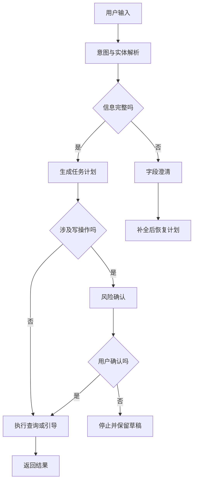

# E04 · 多意图与澄清问题设计

企业 Agent 不是每次都应该“尽快回答”。

很多时候，正确动作是停下来问一句。

这听起来不够智能，但在企业系统里，澄清问题不是能力不足，而是边界意识。

## 多意图输入很常见

企业用户不会按系统能力边界组织语言。

他们经常会把查询、判断、引导、执行揉在一句话里：

> 我下周想休三天，看看年假够不够，够的话帮我提交。

这句话至少包含四个意图：

| 片段 | 意图 |
| --- | --- |
| 下周想休三天 | 时间范围和业务目标 |
| 年假够不够 | 个人数据查询 |
| 够的话 | 条件判断 |
| 帮我提交 | 流程自动化 |

如果系统直接执行，风险很大。

“下周”具体是哪三天？请假类型一定是年假吗？是否需要填写请假原因？用户真的确认要提交吗？

这些问题不澄清，系统就只能猜。

企业 Agent 最怕的不是回答慢，而是猜得很自信。

## 三类澄清触发条件

澄清通常来自三类问题：

| 类型 | 触发条件 | 示例 |
| --- | --- | --- |
| 缺字段 | 执行所需字段不完整 | 没有日期、金额、流程类型、请假原因 |
| 歧义 | 同一表达可能对应多个业务对象 | “假期”可能是年假、调休、病假 |
| 风险 | 动作会改变业务系统状态 | 提交、撤回、审批、删除、修改 |

这三类要分开处理。

缺字段要补信息，歧义要让用户选择，风险要明确确认。

不要把所有澄清都写成“请补充更多信息”。这类问题太大，用户不知道该补什么。

## 澄清节点的位置

澄清不应该只发生在最后。

一个比较稳的企业 Agent 流程是：



这里有两个关键点：

第一，字段澄清发生在计划执行前。信息不完整时，不要先查一堆可能无关的数据。

第二，风险确认发生在写操作前。即使信息完整，也不能直接替用户提交。

## 好的澄清问题长什么样

澄清问题要短、准、可继续执行。

不好的问法：

> 为了更好地帮助你，请补充更多信息。

这个问题没有指出缺什么。

更好的问法：

> 你想请哪三天？请直接给出日期，例如 5 月 20 日到 5 月 22 日。

再看一个歧义场景：

用户说：

> 帮我看看假期还剩多少。

系统不应该默认是年假。更好的澄清是：

> 你想查哪类假期余额？可以选择年假、调休或病假。

风险确认也要明确：

> 我已经确认你 5 月 20 日到 5 月 22 日还有足够年假。是否现在提交请假申请？提交后会进入直属主管审批。

这句话同时说明了动作、条件和后果。

## 澄清之后要能恢复

澄清不是重新开始一轮对话。

很多系统的问题在于：问完用户一个补充问题后，前面的任务状态丢了。用户回答“5 月 20 到 22”，系统又不知道这是在说什么。

所以澄清节点必须绑定原始任务草案。

可以把任务状态抽象成：

```ts
type ClarificationState = {
  sessionId: string
  originalGoal: string
  pendingTask: {
    intent: string
    entities: Record<string, string | null>
    missingFields: string[]
    riskLevel: string
  }
  askField: string
}
```

用户补充信息后，系统不是重新识别全部意图，而是把答案填回 `pendingTask`，再继续原来的计划。

这就是“可恢复”的澄清。

## IMS Copilot 的澄清策略

在 IMS Copilot 里，可以把澄清策略压成三条规则：

| 规则 | 处理方式 |
| --- | --- |
| 查询缺字段 | 问最小必要字段，补齐后继续查 |
| 多能力混合但只读 | 先拆分执行，再综合回答 |
| 涉及流程写入 | 必须展示操作摘要，并等待用户确认 |

例如：

> 帮我把下周三到周五的年假提交一下。

如果系统已经能解析出日期和假期类型，也查到余额足够，仍然不能直接提交。它应该先返回：

> 将为你提交 5 月 20 日到 5 月 22 日的年假申请，共 3 天，审批人是直属主管。确认提交吗？

这不是多余步骤，而是企业 Agent 的安全边界。

## 这一篇的结论

多意图不是异常输入，而是企业 Agent 的常态输入。

澄清问题也不是失败兜底，而是执行控制的一部分。

判断一个澄清设计好不好，看三点：

- 它有没有只问最小必要信息；
- 它有没有保留原始任务状态；
- 它有没有在高风险动作前明确说明后果。

做到这三点，Agent 才不会为了显得聪明而越过边界。
