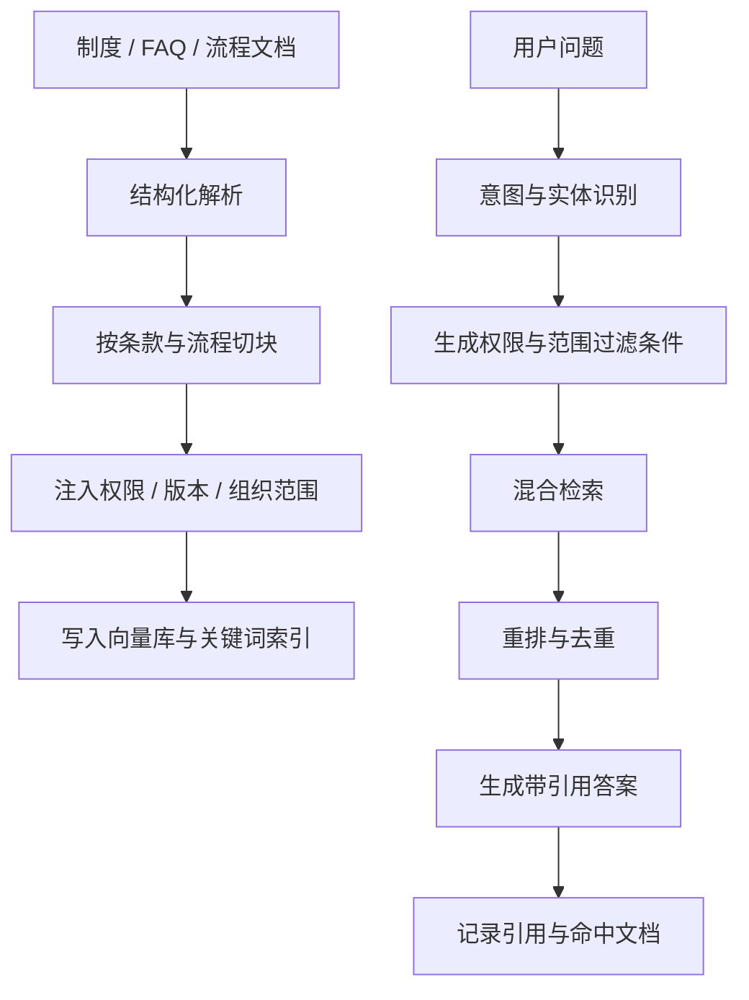

# E05 · 企业知识库不是普通 RAG

Policy Q&A 看起来是企业 Agent 里最简单的一类能力。

把制度文档导入知识库，做 Embedding，用户问问题时向量检索，再让 LLM 总结答案。这个流程很容易跑通。

但企业知识库不是普通 RAG Demo。

普通 RAG 关心“能不能找到相似内容”。企业 RAG 还要关心：

- 用户有没有权限看这份制度；
- 当前命中的文档是不是最新版本；
- 答案能不能回溯到具体条款；
- 不同地区、部门、职级的规则是否不同；
- 文档里的流程入口是否仍然有效。

如果这些不处理，系统看起来会答，但上线后很容易答错、越权或引用过期内容。

## 企业知识库的四个额外维度

普通 RAG 通常只有三件事：文档、切块、向量。

企业知识库至少还要多四个维度：

| 维度 | 要解决的问题 |
| --- | --- |
| 权限 | 谁能看这段内容 |
| 版本 | 当前条款是否仍然有效 |
| 组织范围 | 条款适用于哪个地区、部门、职级 |
| 引用 | 答案能否回到原文和具体章节 |

所以企业知识块不能只存 `text` 和 `embedding`。

更合理的结构是：

```ts
type KnowledgeChunk = {
  chunkId: string
  documentId: string
  title: string
  text: string
  sectionPath: string[]
  effectiveFrom: string
  effectiveTo?: string
  visibility: {
    departments?: string[]
    regions?: string[]
    roles?: string[]
    employeeTypes?: string[]
  }
  sourceUrl: string
  version: string
}
```

这里最重要的是：权限、版本和来源不是额外说明，而是检索条件的一部分。

## 文档切分不能只按长度

很多 RAG Demo 会按固定 token 长度切文档。企业制度文档不适合这么切。

例如请假政策可能长这样：

1. 年假适用范围；
2. 年假天数计算；
3. 年假申请流程；
4. 特殊情况处理；
5. 地区差异说明。

如果按长度硬切，可能把“适用范围”和“计算方式”切开，也可能把“特殊情况”切到另一个 chunk。最后模型检索到半段内容，看起来很相关，但结论不完整。

企业制度更适合按语义结构切：

| 文档结构 | 切分策略 |
| --- | --- |
| 标题 / 小节 | 保留层级路径 |
| 条款编号 | 每条规则独立成块 |
| 表格 | 转成结构化文本，并保留表头 |
| 流程步骤 | 按步骤组块，不拆断前后依赖 |
| 例外说明 | 和主规则建立关联 |

一个 chunk 不一定越短越好。企业知识块的边界应该是“能独立支持一个判断”。

## IMS Policy Q&A 的知识链路

IMS Copilot 的 Policy Q&A 可以按下面的链路设计：



注意这里有两个过滤：

第一，入库时就要写入元数据。不要等检索后再猜这段文档给谁看。

第二，查询时必须带用户上下文。包括用户角色、部门、地区、雇佣类型等。

## 企业知识库里的“同问不同答”

企业 Policy Q&A 经常出现同一个问题，不同用户答案不同。

例如：

> 年假怎么计算？

对正式员工、实习生、外包、不同国家地区，答案可能都不同。

所以 IMS Copilot 不能把问题简单变成：

```text
年假 怎么 计算
```

它应该结合当前用户上下文生成检索条件：

```ts
type PolicyRetrievalContext = {
  query: string
  user: {
    region: 'CN'
    department: 'IMS'
    role: 'employee'
    employeeType: 'full_time'
  }
  time: {
    now: '2026-05-15'
  }
}
```

这样检索阶段才能过滤掉不适用的地区政策、过期版本和无权访问内容。

## 答案必须带引用

企业知识库回答不能只说“根据公司政策”。

它至少要给出：

- 结论；
- 依据条款；
- 文档名称；
- 生效版本；
- 如果适用范围有限，要说明范围。

例如：

> 按《员工休假管理办法》2026 版第 2.3 条，正式员工年假天数按司龄计算。你当前属于中国区正式员工，适用该规则。具体天数还需要结合你的入职日期查询个人数据。

这类回答有两个好处：

第一，用户知道答案从哪里来。

第二，系统后续可以审计“这次回答引用了哪份文档”。

## 这一篇的结论

企业知识库不是“向量库 + Prompt”。

它至少要把四件事做成基础能力：

- 按业务语义切块；
- 把权限、版本、组织范围写成元数据；
- 查询时带用户上下文做过滤；
- 生成答案时必须带引用。

IMS Copilot 的 Policy Q&A 只有在这个基础上，才能继续谈权限过滤、引用溯源和 Text-to-SQL 组合查询。
