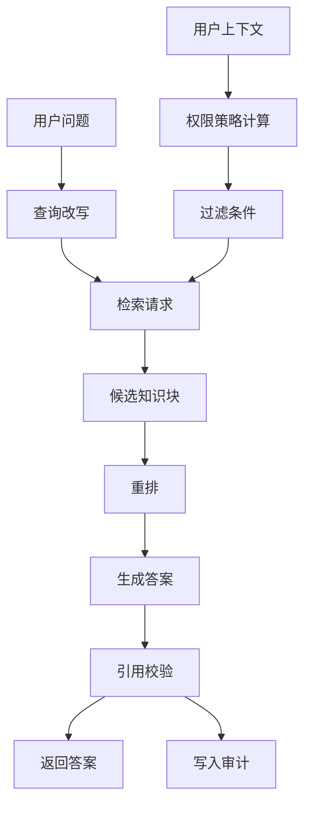

# E06 · 权限过滤与引用溯源

企业 RAG 有一个常见误区：

> 先把最相关的内容检索出来，再把用户没权限看的内容过滤掉。

这个设计看起来简单，但在 Agent 场景里不安全。

因为只要不该看的内容进入了 LLM 上下文，就已经发生了泄露风险。即使最终回答没有直接引用，模型也可能被这些内容影响。

所以企业 RAG 的第一条原则是：

> 权限过滤必须发生在检索阶段，而不是答案生成之后。

## 权限过滤分三层

IMS Copilot 的 Policy Q&A 可以把权限过滤分成三层：

| 层级 | 作用 | 示例 |
| --- | --- | --- |
| 查询前 | 根据用户上下文生成过滤条件 | region、department、role |
| 检索中 | 向量库和关键词检索都强制带过滤 | Milvus expr / SQL where |
| 生成后 | 校验答案引用是否来自允许文档 | citation allowlist |

这三层不是三选一，而是都要有。



查询改写可以由模型参与，但过滤条件不能由模型自由生成。它必须来自后端可信用户上下文和权限策略。

## 不要相信 Prompt 权限

有些系统会在 Prompt 里写：

> 你只能回答当前用户有权限看到的内容。

这只能作为辅助提示，不能作为安全边界。

真正的安全边界应该长这样：

```ts
type RetrievalFilter = {
  documentStatus: 'active'
  effectiveAt: string
  visibility: {
    regionIn: string[]
    departmentIn: string[]
    roleIn: string[]
  }
}
```

然后由检索工具把它转换成 Milvus、Elasticsearch 或数据库自己的过滤表达式。

模型不应该有机会把这个过滤条件删掉。

## 引用溯源不是装饰

很多 RAG 产品把引用当成 UI 装饰：答案下面挂几个“参考来源”。

企业 Agent 里，引用是审计链路的一部分。

每条引用至少要包含：

| 字段 | 用途 |
| --- | --- |
| document_id | 知道来自哪份文档 |
| chunk_id | 定位到具体知识块 |
| version | 确认引用版本 |
| section_path | 定位章节 |
| source_url | 用户可打开原文 |
| permission_snapshot | 记录当时为什么可见 |

如果一个答案没有引用，系统就很难解释它为什么这么答。

如果引用文档已经过期，系统也应该能在审计中发现。

## 生成后要做引用校验

即使检索阶段做了过滤，生成后仍然要校验引用。

原因很简单：LLM 可能编造引用，也可能把多个知识块混在一起说。

最低限度的校验包括：

1. 答案中的引用必须来自本次检索候选集；
2. 引用 chunk 必须属于当前用户允许访问范围；
3. 引用版本必须在当前时间有效；
4. 关键结论必须能在引用文本中找到支撑。

如果校验失败，系统应该降级回答：

> 当前没有找到可引用的有效制度条款，无法给出确定结论。

这比编一个看起来完整的答案更好。

## IMS 的权限与引用链路

IMS Copilot 可以把一次 Policy Q&A 的审计记录压成：

```ts
type PolicyQaAuditEvent = {
  sessionId: string
  userId: string
  question: string
  retrievalFilter: RetrievalFilter
  retrievedChunkIds: string[]
  citedChunkIds: string[]
  answerSummary: string
  createdAt: string
}
```

注意这里不一定要把完整答案和完整文档都写进审计表。很多企业里，审计数据本身也有权限和敏感性。

更稳的方式是保存摘要、ID 和权限快照，需要追溯时再按权限读取原文。

## 常见坏味道

企业 RAG 里有几个明显坏味道：

- 检索所有文档，再在前端隐藏无权文档；
- 只在 Prompt 里告诉模型不要泄露；
- 答案没有引用，或者引用只是文档标题；
- 引用不区分版本；
- 审计只记录最终回答，不记录检索条件和命中文档。

这些设计短期能跑 Demo，但一旦接入真实制度和人员数据，就会变成风险。

## 这一篇的结论

权限过滤和引用溯源，是企业知识库的两条硬边界。

权限过滤决定 Agent 能看什么。

引用溯源决定 Agent 为什么这么答。

IMS Copilot 的 Policy Q&A 必须把这两条链路做在检索、生成和审计的主流程里，而不是做成 UI 层的补丁。
