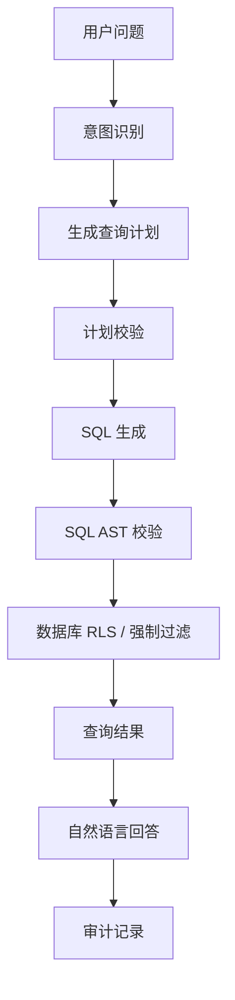

# E07 · Text-to-SQL 在企业场景的风险与管控

Text-to-SQL 很容易让人兴奋。

用户问一句“我这个月请了几天假”，模型生成 SQL，数据库返回结果，系统再总结成自然语言。这个体验非常接近企业 Copilot 的理想形态。

但在企业场景里，Text-to-SQL 也是最容易翻车的能力之一。

原因很简单：数据库里不是文档，而是真实业务数据。

查错一张表、漏掉一个权限条件、扫全库、生成写操作，都可能造成严重问题。

## 企业 Text-to-SQL 的四类风险

| 风险 | 说明 | 示例 |
| --- | --- | --- |
| 越权 | 查到当前用户不该看的数据 | 普通员工查到他人薪资 |
| 误查 | SQL 语义和用户问题不一致 | 把申请日期当成休假日期 |
| 写入 | 模型生成修改数据的语句 | update、delete、insert |
| 性能 | 查询范围失控 | 无 where 条件扫大表 |

所以企业 Text-to-SQL 的底线是：

> 模型可以参与生成查询意图，但不能直接拥有数据库自由查询权。

## 不要把整库 schema 丢给模型

很多 Demo 会把数据库 schema 全部塞进 Prompt，让模型自己写 SQL。

企业系统不能这么做。

更稳的方式是按业务场景暴露 schema 白名单。

例如 IMS Copilot 的“假期余额查询”只需要：

```ts
type LeaveBalanceSchema = {
  tables: ['leave_balance', 'leave_transaction']
  allowedColumns: {
    leave_balance: ['user_id', 'leave_type', 'remaining_days', 'updated_at']
    leave_transaction: ['user_id', 'leave_type', 'days', 'occurred_at', 'status']
  }
  requiredFilters: ['user_id']
  mode: 'read_only'
}
```

模型不需要知道薪资表、绩效表、审批配置表。

它看不到，就不会乱查。

## 推荐链路：NL 到查询计划，而不是直接到 SQL

企业场景里，不建议让模型一步生成最终 SQL。

更稳的链路是：



其中最关键的是两个校验：

- 查询计划校验：确认要查的业务对象、字段和过滤条件合理；
- SQL AST 校验：确认最终 SQL 只读、只访问白名单表、带必要过滤条件。

## SQL 校验要看结构，不要靠字符串

不要用简单字符串判断：

```text
不包含 delete 就安全
```

这不可靠。

更好的方式是解析 SQL AST，然后检查：

| 校验项 | 要求 |
| --- | --- |
| 语句类型 | 只允许 SELECT |
| 表名 | 必须在白名单内 |
| 字段 | 必须在白名单内 |
| 过滤条件 | 必须包含用户维度或租户维度 |
| limit | 必须有上限 |
| join | 只允许预定义 join |

如果校验不通过，不要让 SQL 进入数据库。

## 权限必须下沉到数据库

应用层注入 `user_id` 过滤是必要的，但还不够。

更稳的做法是数据库侧也启用行级安全策略，也就是 RLS。

这样即使某个工具层漏了过滤条件，数据库仍然会拒绝返回不属于当前用户的数据。

IMS Copilot 可以采用双保险：

1. 工具层强制注入当前 `user_id`、tenant、department 等上下文；
2. PostgreSQL RLS 再根据数据库会话变量限制可见行。

这样权限不依赖模型，也不只依赖应用代码。

## 查询结果也要控量

Text-to-SQL 还有一个常被忽略的问题：结果太多。

即使查询没有越权，把几千行结果塞回 LLM 也不合适。

企业 Agent 应该对查询结果做三件事：

- 默认 limit；
- 聚合优先；
- 明细查询需要更明确的用户意图。

例如用户问“我今年请假情况怎么样”，系统应该优先返回按假期类型聚合的统计，而不是把每条请假记录都塞进上下文。

## IMS 中 Text-to-SQL 的适用边界

IMS Copilot 里，Text-to-SQL 适合处理：

- 当前用户自己的假期余额；
- 当前用户自己的考勤统计；
- 当前用户发起的流程状态；
- 被授权管理范围内的团队汇总。

不适合直接开放：

- 薪资明细；
- 绩效评价；
- 全员人员信息；
- 任意跨表自由分析。

这些不是模型能力问题，而是企业数据治理问题。

## 这一篇的结论

企业 Text-to-SQL 不应该追求“模型想查什么就查什么”。

它应该是一条受控链路：

- schema 白名单限制可见世界；
- 查询计划把自然语言变成业务意图；
- SQL AST 校验拦截危险语句；
- RLS 保证行级权限；
- limit 和聚合控制结果规模；
- 审计记录保存问题、计划、SQL 摘要和结果摘要。

这样 Text-to-SQL 才能成为企业 Agent 的能力，而不是事故入口。
