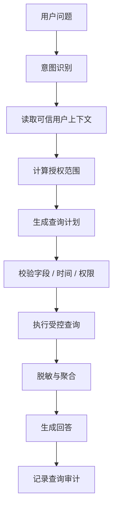

# E08 · 个人数据查询的上下文设计

Policy Q&A 查的是制度，个人数据查询查的是人。

这两类能力看起来都可以做成“问一句，查一下，答回来”，但底层约束完全不同。

制度文档通常是共享知识，个人数据则天然带身份边界。用户问“我的年假还剩多少”，系统不能只理解“年假余额”这个业务概念，还必须知道“我”是谁、能查什么、查哪个时间范围、结果能不能展示给当前会话。

所以个人数据查询的核心不是 SQL，而是上下文。

## “我的”不是一个词，是一个安全边界

企业 Agent 里最危险的词之一就是“我的”。

用户说：

> 查一下我的考勤。

系统不能把“我的”交给 LLM 自己理解。它必须从可信会话里拿到当前用户身份。

更准确地说，个人数据查询至少需要四类上下文：

| 上下文 | 作用 | 示例 |
| --- | --- | --- |
| 身份上下文 | 确认当前用户是谁 | user_id、employee_id、tenant_id |
| 授权上下文 | 确认能查哪些范围 | 自己、直属团队、指定部门 |
| 时间上下文 | 限定查询窗口 | 本月、今年、某个审批周期 |
| 用途上下文 | 判断回答粒度 | 查询余额、解释异常、准备发起流程 |

没有这些上下文，Agent 查出来的数据就没有安全含义。

## 个人数据查询的最小链路

IMS Copilot 的个人数据查询，可以按这个链路走：



这里有两个点特别重要。

第一，用户上下文来自登录态、组织系统或后端会话，不来自模型猜测。

第二，授权范围要在查询前计算，而不是查完后再过滤。

## 当前用户和被查询对象要分开

很多权限问题来自一个混淆：当前用户不一定等于被查询对象。

普通员工问“我的年假还剩多少”，当前用户和被查询对象是同一个人。

经理问“我团队这个月请假情况怎么样”，当前用户是经理，被查询对象是团队成员。

HR 问“上海办公室本月入职人数”，当前用户是 HR，被查询对象是一个组织范围。

所以查询计划里应该明确区分：

```ts
type PersonalDataQueryPlan = {
  requester: {
    userId: string
    roles: string[]
  }
  subjectScope: {
    type: 'self' | 'direct_team' | 'department' | 'custom'
    ids: string[]
  }
  dataDomain: 'attendance' | 'leave' | 'workflow'
  timeRange: {
    start: string
    end: string
  }
  purpose: 'answer' | 'diagnose' | 'prepare_action'
}
```

这个结构能避免一个常见错误：把“我能问”误解成“我能查所有相关数据”。

## 回答粒度要受权限影响

同样是团队请假数据，不同角色能看到的粒度不同。

| 用户角色 | 合理回答 |
| --- | --- |
| 普通员工 | 只能看自己的记录 |
| 直属经理 | 可以看团队成员的请假状态，但不一定能看原因 |
| HR | 可以看授权范围内统计和明细 |
| 高层管理者 | 更适合看聚合指标，不应默认展开个人明细 |

这意味着个人数据查询不是“有权限就全量返回”。

系统还要根据用途和角色控制展示粒度：

- 余额类问题可以返回具体数字；
- 趋势类问题优先返回聚合；
- 明细类问题要确认查询范围；
- 敏感字段默认脱敏或不返回。

## IMS 场景：查年假余额

用户问：

> 我今年年假还剩多少？

一个安全的执行过程是：

1. 意图识别为 `leave_balance_query`；
2. 从会话拿到当前 `employee_id`；
3. 时间范围解析为今年；
4. 查询计划强制加入 `subjectScope = self`；
5. 数据库层通过 RLS 再限制只能看到当前用户行；
6. 返回余额、更新时间和必要说明；
7. 审计记录查询域、时间范围和结果摘要。

最终回答可以是：

> 你今年年假还剩 6 天，数据更新时间是 2026 年 5 月 15 日。这个结果只统计已审批通过和已入账的记录，如果你今天刚提交请假，可能还没有计入余额。

这个回答比“你还剩 6 天”更稳，因为它说明了数据口径。

## 这一篇的结论

个人数据查询的重点不是让模型会写 SQL，而是让查询始终带着可信上下文运行。

IMS Copilot 至少要明确：

- 当前用户是谁；
- 被查询对象是谁；
- 当前用户能查到什么范围；
- 时间窗口是什么；
- 结果应该以什么粒度展示；
- 这次查询怎么被审计。

这些上下文不清楚，个人数据能力就不应该执行。
