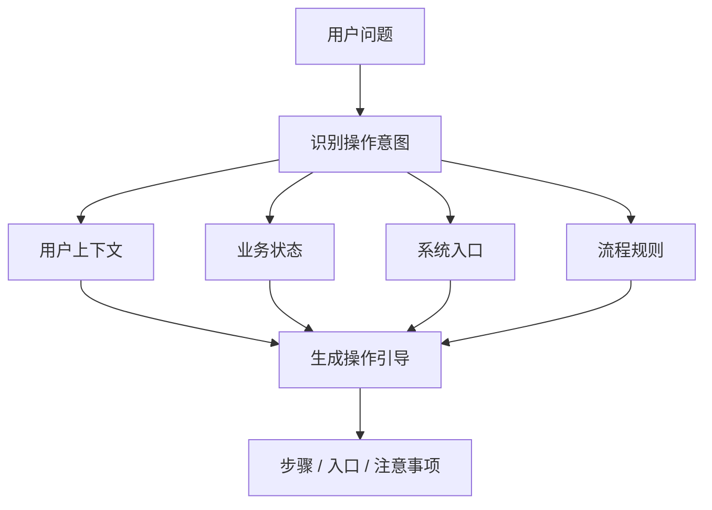

# E09 · 操作引导不是把文档换成对话

很多企业 Copilot 的操作引导，最后会退化成“把帮助文档换成聊天回答”。

用户问“怎么申请调休”，系统回答：

> 进入 OA 系统，选择休假申请，填写调休类型，提交审批。

这当然比让用户自己翻文档好一点，但它还不是好的操作引导。

真正的操作引导，不只是告诉用户“理论上怎么做”，而是告诉用户“你现在应该怎么做”。

## 文档问答和操作引导的区别

可以先把边界拉开：

| 能力 | 回答的问题 | 依赖信息 |
| --- | --- | --- |
| 文档问答 | 规则是什么 | 制度文档 |
| 操作引导 | 当前用户下一步怎么做 | 用户角色、流程状态、系统入口、限制条件 |

用户问：

> 怎么申请调休？

文档问答会解释调休申请流程。

操作引导还要判断：

- 用户有没有可用调休额度；
- 当前系统入口在哪里；
- 是否需要先选择加班记录；
- 申请后会进入谁审批；
- 当前用户所在地区是否有不同流程；
- 是否可以直接帮用户预填表单。

所以操作引导不是更长的答案，而是更贴近当前上下文的行动建议。

## 操作引导需要四类信息

IMS Copilot 的操作引导至少要读取四类信息：

| 信息 | 作用 |
| --- | --- |
| 用户上下文 | 判断角色、地区、员工类型 |
| 业务状态 | 判断是否满足当前操作条件 |
| 系统入口 | 给出可点击或可跳转的入口 |
| 流程规则 | 说明下一步和审批后果 |

这四类信息组合起来，才能生成真正可执行的引导。



## 引导应该按“当前状态”分支

同一个问题，不同状态下答案不同。

例如用户问：

> 我想申请调休，怎么弄？

可能有三种情况：

| 状态 | 应答 |
| --- | --- |
| 有可用调休额度 | 给出申请入口和步骤 |
| 没有可用额度 | 说明当前不能申请，给出原因 |
| 额度未同步 | 说明需要等待数据入账或联系 HR |

如果系统不查状态，只复述流程文档，就会把用户带到一个可能走不通的入口。

好的操作引导应该减少无效点击。

## 步骤不要太泛

操作引导的步骤要能落到系统界面或动作。

不好的步骤：

1. 打开系统；
2. 填写信息；
3. 提交。

这太空。

更好的步骤：

1. 打开 IMS 首页右上角“我的申请”；
2. 选择“休假申请”；
3. 假期类型选择“调休”；
4. 选择要抵扣的加班记录；
5. 填写调休日期；
6. 提交后进入直属主管审批。

如果系统能提供入口链接，还应该把链接作为结构化结果返回，而不是只写在自然语言里。

```ts
type OperationGuide = {
  title: string
  steps: {
    label: string
    target?: {
      system: 'IMS' | 'OA' | 'HR'
      route: string
    }
    note?: string
  }[]
  warnings: string[]
}
```

这能让前端把“步骤说明”和“跳转入口”分开渲染。

## 操作引导和流程自动化的边界

操作引导告诉用户怎么做。

流程自动化替用户做。

两者不要混在一起。

例如：

> 帮我看看怎么提交年假申请。

这是操作引导。

> 帮我提交 5 月 20 日到 22 日的年假申请。

这是流程自动化，必须进入确认节点。

IMS Copilot 可以在操作引导的最后提供下一步：

> 我可以帮你生成申请草稿，但提交前需要你确认。

这样既保留 Agent 能力，也不越过用户授权。

## 这一篇的结论

操作引导不是把文档改写成对话。

它要基于当前用户、当前状态、当前系统入口和流程规则，给出能实际走下去的步骤。

判断一条操作引导好不好，看三个问题：

- 用户看完是否知道下一步点哪里；
- 当前状态是否支持这一步；
- 如果继续自动化，是否明确进入确认边界。

做到这些，操作引导才是 Copilot，而不是聊天版帮助中心。
