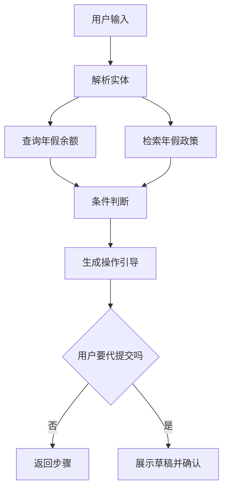
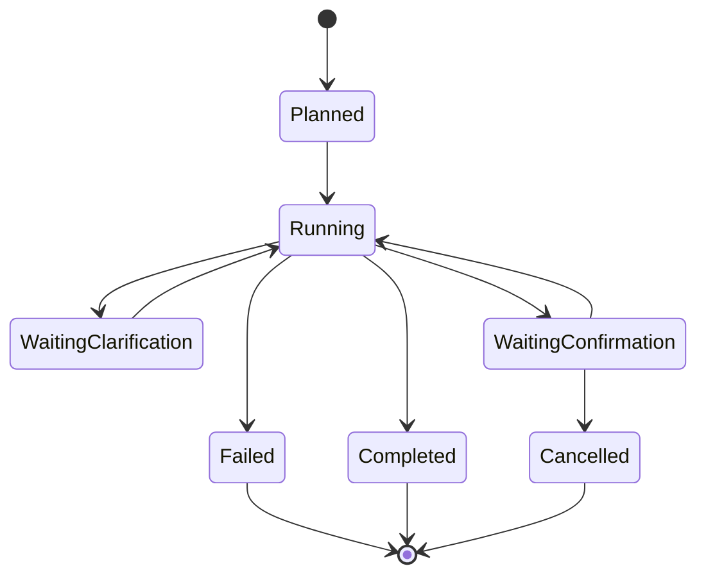

# E10 · 从意图到可执行步骤

到这里，IMS Copilot 已经有了三层能力：

- 能识别用户意图；
- 能查询个人数据；
- 能给出操作引导。

但还缺一个关键东西：把意图变成可执行步骤。

很多 Agent Demo 会让模型输出一段自然语言计划：

> 第一步查询余额，第二步判断是否满足条件，第三步告诉用户怎么申请。

这个计划给人看可以，给系统执行还不够。

企业 Agent 的 Planner 应该输出的是可执行步骤，而不是漂亮文字。

## 什么叫可执行步骤

一个可执行步骤至少要回答六个问题：

| 问题 | 含义 |
| --- | --- |
| 做什么 | 当前步骤的动作类型 |
| 查哪里 | 使用哪个系统或工具 |
| 用什么输入 | 需要哪些实体和上下文 |
| 产出什么 | 输出数据给谁使用 |
| 风险多高 | 是否需要确认或拦截 |
| 失败怎么办 | 能否重试、澄清或终止 |

如果一个步骤没有输入输出定义，它就只是建议。

如果一个步骤没有风险等级，它就不能安全执行。

## 示例：从一句话生成步骤

用户说：

> 我下周三到周五想请年假，帮我看看够不够，如果够就告诉我怎么申请。

这不是一个单步任务。

它应该被拆成：

1. 解析日期和假期类型；
2. 查询当前用户年假余额；
3. 检索年假申请政策；
4. 判断是否满足申请条件；
5. 生成操作引导；
6. 如果用户要求代提交，再进入确认节点。



这条链路同时用到了个人数据、Policy Q&A 和操作引导。

## 可执行计划的数据结构

可以把 Planner 输出设计成这样：

```ts
type ExecutablePlan = {
  goal: string
  riskLevel: 'read_only' | 'guided' | 'confirm_required' | 'blocked'
  steps: {
    id: string
    type: 'parse' | 'query_personal_data' | 'retrieve_policy' | 'reason' | 'guide' | 'confirm'
    tool?: string
    input: Record<string, string>
    outputKey: string
    requires: string[]
    onFailure: 'clarify' | 'stop' | 'fallback'
  }[]
}
```

重点不是字段名，而是几个原则：

- 每步有明确类型；
- 每步知道依赖哪些前置输出；
- 每步输出能被后续步骤引用；
- 每步失败时有处理方式；
- 整体计划有风险等级。

这样 Planner 才能从“写计划”变成“排执行图”。

## 不要让模型绕过状态机

企业 Agent 不能每一步都临时问模型“下一步做什么”。

更稳的方式是：模型参与生成计划，但执行过程由状态机控制。



状态机的价值是：系统知道自己现在是缺信息、等确认、执行中，还是已经完成。

这对企业流程很重要，因为很多任务不是一轮对话就结束。

## IMS Copilot 的 Planner 边界

IMS Copilot 的 Planner 不应该负责所有事。

它负责：

- 把用户目标拆成步骤；
- 选择需要的能力；
- 声明输入、输出和依赖；
- 标记风险和确认点。

它不负责：

- 绕过权限校验；
- 直接执行 SQL；
- 直接提交流程；
- 编造缺失字段；
- 忽略工具返回的错误。

换句话说，Planner 是编排层，不是特权层。

## 从操作引导走向流程自动化

E09 讲过，操作引导和流程自动化的边界在于：是否替用户执行。

E10 要补上中间层：先生成可执行步骤，再决定哪些步骤可以自动执行，哪些步骤必须问人。

例如请假场景：

| 步骤 | 是否可自动执行 |
| --- | --- |
| 解析日期 | 可以 |
| 查询余额 | 可以 |
| 检索政策 | 可以 |
| 判断条件 | 可以 |
| 生成申请草稿 | 可以 |
| 提交申请 | 必须确认 |

这张表就是后续 E11 Human-in-the-Loop 的入口。

## 这一篇的结论

企业 Agent 的 Planner 不应该输出“看起来合理”的文字计划。

它应该输出可执行、可校验、可恢复的步骤图。

每一步都要有：

- 输入；
- 输出；
- 数据源；
- 权限边界；
- 风险等级；
- 失败处理。

这样 IMS Copilot 才能从“会回答”走向“能协助完成任务”，同时不突破企业系统的安全边界。
