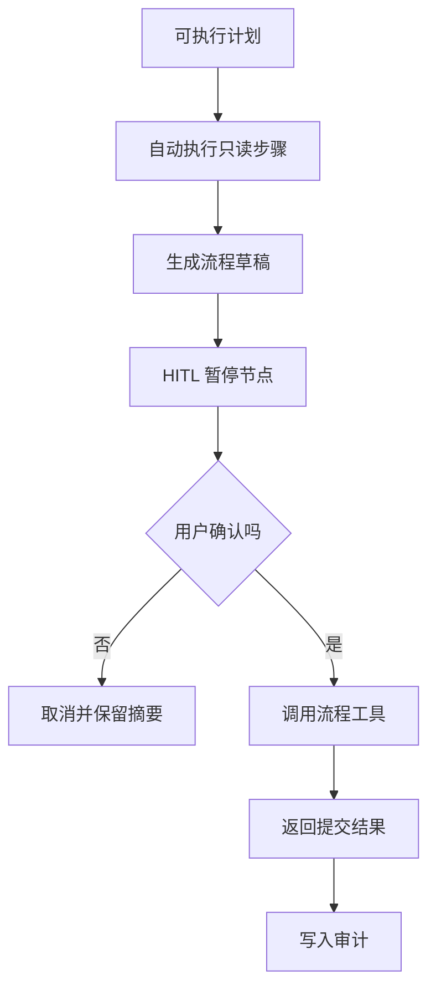

# E11 · Human-in-the-Loop 节点设计

企业 Agent 只要开始“替用户做事”，就必须面对一个问题：

> 哪些步骤可以自动执行，哪些步骤必须停下来问人？

Human-in-the-Loop 通常被理解成“弹一个确认框”。但在企业 Agent 里，它不是 UI 细节，而是执行图里的控制节点。

它同时承担三件事：

- 暂停：让 Agent 在高风险动作前停住；
- 确认：让用户明确知道即将发生什么；
- 恢复：用户确认后，Agent 能接着原计划继续执行。

## 什么时候必须进入 HITL

IMS Copilot 可以先按风险划分：

| 动作类型 | 是否需要 HITL | 示例 |
| --- | --- | --- |
| 只读查询 | 通常不需要 | 查年假余额 |
| 操作引导 | 不需要 | 告诉用户去哪里申请 |
| 生成草稿 | 视情况需要 | 生成请假申请草稿 |
| 写入业务系统 | 必须需要 | 提交请假、撤回申请 |
| 影响他人的动作 | 必须需要 | 审批、驳回、分配任务 |

判断标准很简单：如果动作会改变企业系统状态，或者影响其他人的流程，就应该进入 HITL。

## 确认节点要展示什么

一个好的确认节点，不是问：

> 是否确认？

这太空了。

它应该展示完整的操作摘要：

| 信息 | 作用 |
| --- | --- |
| 动作 | 用户确认要做什么 |
| 对象 | 影响哪条记录、哪个流程、哪个人 |
| 关键字段 | 日期、金额、类型、原因等 |
| 后果 | 提交后进入谁审批、是否可撤回 |
| 数据来源 | 哪些信息由系统查询得到，哪些由用户输入 |

例如请假提交前，IMS Copilot 应该展示：

> 将为你提交 2026 年 5 月 20 日到 5 月 22 日的年假申请，共 3 天。系统已确认你当前年假余额足够。提交后会进入直属主管审批。确认提交吗？

这句话不是文案优化，而是风险控制。

## HITL 是状态，不是一轮对话

确认节点必须能持久化。

用户可能不是马上回复，也可能刷新页面、切换设备，甚至半小时后才点确认。

所以系统需要保存一个 pending action：

```ts
type PendingHumanAction = {
  id: string
  sessionId: string
  userId: string
  actionType: 'submit_leave' | 'approve_request' | 'cancel_workflow'
  summary: string
  payload: Record<string, string>
  riskLevel: 'confirm_required'
  expiresAt: string
  status: 'waiting' | 'confirmed' | 'cancelled' | 'expired'
}
```

用户确认后，Agent 不是重新理解一次自然语言，而是恢复这个 pending action。

## 执行图里的暂停点

可以把 HITL 放在执行图里：



这张图里，HITL 的位置非常关键：它在“草稿生成后、真实写入前”。

太早确认，用户不知道确认什么。

太晚确认，系统可能已经写入了。

## 这一篇的结论

Human-in-the-Loop 不是“让用户参与一下”。

它是企业 Agent 的安全阀：

- 高风险动作前暂停；
- 展示足够清楚的操作摘要；
- 保存可恢复状态；
- 用户确认后继续原计划；
- 全程写入审计链路。

IMS Copilot 只有把 HITL 设计成执行节点，而不是 UI 弹窗，才能安全地从操作引导走向流程自动化。
