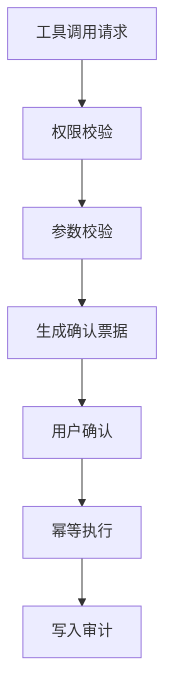

# E12 · 高风险工具调用的确认机制

企业 Agent 的能力最终会落到工具调用上。

查余额是工具调用，检索制度是工具调用，提交请假也是工具调用。

但这些工具的风险完全不同。不能把所有工具都当成“模型想调就调”的函数。

## 先给工具分级

IMS Copilot 可以把工具分成四级：

| 等级 | 含义 | 示例 | 默认策略 |
| --- | --- | --- | --- |
| L0 | 无副作用只读 | 检索制度、查个人余额 | 可自动执行 |
| L1 | 低风险只读聚合 | 查团队统计 | 权限校验后执行 |
| L2 | 生成草稿或预填 | 生成请假草稿 | 可执行但不提交 |
| L3 | 写入或影响流程 | 提交、撤回、审批 | 必须确认 |

这个分级要写在工具注册表里，而不是写在 Prompt 里。

```ts
type ToolDefinition = {
  name: string
  riskLevel: 'L0' | 'L1' | 'L2' | 'L3'
  requiredPermission: string
  sideEffect: 'none' | 'draft' | 'write'
  idempotent: boolean
}
```

模型可以选择工具，但不能改变工具风险等级。

## 高风险工具调用的四道门

L3 工具调用至少要经过四道门：

1. 权限校验：当前用户能不能执行；
2. 参数校验：字段是否完整、合法；
3. 用户确认：是否确认这次具体操作；
4. 幂等执行：避免重复提交。



少任何一道，都容易出事故。

## 确认票据要冻结参数

确认票据不是“用户点过确认”的布尔值。

它应该绑定这次具体动作和参数。

例如：

```ts
type ConfirmationTicket = {
  ticketId: string
  userId: string
  toolName: 'submit_leave_request'
  frozenPayloadHash: string
  summary: string
  expiresAt: string
  status: 'pending' | 'confirmed' | 'used' | 'expired'
}
```

用户确认的是这个 frozen payload。

如果确认后参数被改了，票据就不能继续使用。

这能防止一种隐蔽风险：用户确认的是 A，系统实际提交的是 B。

## 幂等键不能省

流程类工具经常遇到重复提交。

用户点了两次确认，网络重试了一次，Agent 恢复执行时又调用一次工具，都可能造成重复申请。

所以高风险工具应该带幂等键：

```ts
type ToolExecutionRequest = {
  toolName: string
  payload: Record<string, string>
  confirmationTicketId: string
  idempotencyKey: string
}
```

业务系统收到同一个 `idempotencyKey`，应该返回同一个执行结果，而不是重复创建流程。

## 错误要明确，不要隐式容错

高风险工具失败时，不能让 LLM 自己猜下一步。

常见失败要明确分类：

| 失败类型 | 处理方式 |
| --- | --- |
| 权限不足 | 停止并说明 |
| 参数不合法 | 回到澄清节点 |
| 确认票据过期 | 重新生成摘要并确认 |
| 业务系统失败 | 保留状态，提示稍后重试 |
| 重复提交 | 返回已有流程号 |

这类错误应该由工具层返回结构化结果，而不是只给一段错误文本。

## 这一篇的结论

高风险工具调用不能靠“模型自觉”。

它需要工程边界：

- 工具注册时标明风险等级；
- L3 写操作必须走权限、参数、确认、幂等四道门；
- 确认票据冻结本次参数；
- 执行结果和失败类型都要结构化；
- 审计记录要串起用户、票据、工具和业务流程号。

这样 IMS Copilot 才能安全地调用真实业务系统。
