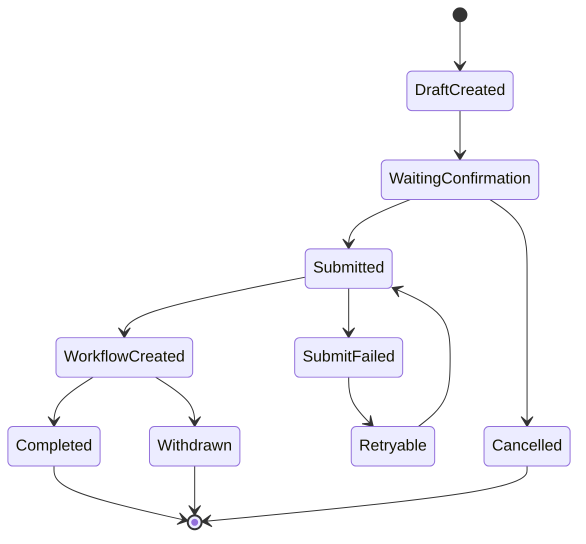

# E13 · 流程状态、回滚与补偿

流程自动化最容易被低估的一点是：真实业务系统不会永远成功。

请假提交可能超时，审批系统可能返回错误，用户可能重复确认，流程可能已经被别人处理。

如果 Agent 只会“调用工具，然后等待结果”，它很快会遇到状态混乱。

企业 Agent 必须把流程状态当成一等公民。

## 自动化流程不是一次函数调用

看起来“提交请假申请”只是一次工具调用。

实际链路可能是：

1. 生成申请草稿；
2. 用户确认；
3. 调用 OA 创建流程；
4. OA 返回流程号；
5. Agent 记录审计；
6. 用户后续查询流程状态。

任何一步都可能失败。

所以 IMS Copilot 需要保存流程执行状态，而不是只等工具返回。



状态机能回答一个关键问题：现在这件事到底走到哪一步了。

## 回滚不是万能的

很多工程师会说：“失败了就回滚。”

但企业流程里，很多动作不能真正回滚。

| 动作 | 能否回滚 | 处理方式 |
| --- | --- | --- |
| 生成本地草稿 | 可以 | 删除草稿 |
| 提交前确认 | 可以 | 取消 pending action |
| 已创建流程但未审批 | 可能可以 | 调用撤回流程 |
| 已被审批通过 | 通常不能 | 发起反向流程或人工处理 |
| 已通知他人 | 不能完全回滚 | 发送更正通知 |

所以更准确的说法不是“回滚”，而是“补偿”。

补偿动作是用新的业务动作修正前一个动作带来的影响。

## 补偿动作要预先定义

不要等事故发生后再让模型想办法。

每个高风险工具都应该定义补偿策略：

```ts
type WorkflowActionPolicy = {
  action: 'submit_leave_request'
  reversibleUntil: 'before_manager_approval'
  compensation?: {
    toolName: 'withdraw_leave_request'
    requiredPermission: 'leave.withdraw.self'
    requiresConfirmation: true
  }
}
```

这能让系统提前知道：什么状态下还能撤回，什么状态下只能提示人工处理。

## 失败恢复要看状态

同样是提交失败，处理方式也不同。

| 状态 | 处理方式 |
| --- | --- |
| 工具调用前失败 | 保留草稿，可重新确认 |
| 调用超时但不知道是否成功 | 用幂等键查询结果 |
| OA 明确返回失败 | 展示原因，允许修改参数 |
| OA 创建成功但审计写入失败 | 补写审计，不重复创建流程 |
| 用户重复确认 | 返回已有流程号 |

这就是为什么 E12 里强调幂等键。

没有幂等键，Agent 遇到超时时就不知道该重试还是该停。

## 用户要看到真实状态

流程自动化失败时，最糟糕的回答是：

> 出现错误，请稍后再试。

这会让用户不知道流程有没有提交成功。

更好的回答应该说明状态：

> 申请已经提交到 OA，流程号是 LV-20260515-003。审计记录稍后会补写，不需要重复提交。

或者：

> 当前无法确认 OA 是否创建成功，我会用本次提交的幂等键查询结果。请不要重复提交。

企业 Agent 的可信度，很多时候来自这种状态说明。

## IMS Copilot 的流程自动化底线

IMS Copilot 做流程自动化时，至少要保存：

- plan_id：原始执行计划；
- pending_action_id：确认节点；
- idempotency_key：幂等执行；
- external_workflow_id：外部流程号；
- current_state：当前状态；
- compensation_policy：补偿策略；
- audit_event_ids：审计事件。

这些数据不是为了复杂而复杂，而是为了回答生产环境最常见的问题：

> 这件事到底有没有做成？如果没做成，能不能恢复？如果做错了，怎么补救？

## 这一篇的结论

流程自动化不是一次工具调用，而是一段有状态的业务执行。

企业 Agent 必须区分：

- 可取消；
- 可重试；
- 可撤回；
- 可补偿；
- 不可自动处理。

IMS Copilot 只有把状态、幂等、补偿和审计放进主链路，才有资格替用户推进真实流程。
