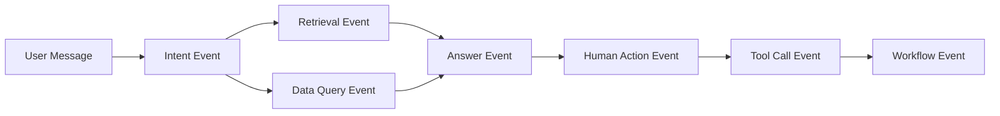

# E14 · 企业 Agent 的观测与审计

企业 Agent 上线后，最常见的问题不是“它能不能回答”，而是：

> 它为什么这么回答？它到底查了什么？它有没有越权？它替用户做了什么？

普通应用日志通常记录请求、响应、耗时、错误。企业 Agent 还要记录推理链路、检索来源、工具调用、人工确认和流程状态。

这不是为了看起来专业，而是为了在出问题时能追得回来。

## Agent 审计要追的是链路

一次 IMS Copilot 会话可能包含：

1. 用户输入；
2. 意图识别；
3. 查询计划；
4. 知识库检索；
5. 个人数据查询；
6. 操作引导；
7. 人工确认；
8. 工具调用；
9. 最终回答。

如果只记录最终答案，审计基本没有价值。

更合理的做法是把每个关键动作都记录成事件：



这些事件共享同一个 `session_id` 和 `trace_id`，才能串成完整链路。

## 审计事件模型

IMS Copilot 可以先定义一个统一事件模型：

```ts
type AgentAuditEvent = {
  eventId: string
  traceId: string
  sessionId: string
  userId: string
  eventType:
    | 'intent_detected'
    | 'policy_retrieved'
    | 'personal_data_queried'
    | 'human_confirmation_requested'
    | 'tool_called'
    | 'workflow_updated'
    | 'answer_generated'
  summary: string
  metadata: Record<string, string>
  createdAt: string
}
```

注意这里用 `summary` 和 `metadata`，不是默认把所有原始输入输出都存进去。

因为审计数据本身也可能包含敏感信息。

## 哪些东西必须记录

企业 Agent 至少要记录这些维度：

| 维度 | 作用 |
| --- | --- |
| 用户和会话 | 知道谁发起、在哪个上下文发起 |
| 意图和计划 | 知道系统如何理解任务 |
| 检索条件 | 知道知识库过滤了什么范围 |
| 引用来源 | 知道答案依据哪些文档 |
| 数据查询摘要 | 知道查询了哪个数据域和时间范围 |
| 人工确认 | 知道用户确认了什么 |
| 工具调用 | 知道真实执行了什么动作 |
| 外部流程号 | 能回到业务系统追踪 |

这些信息能回答“为什么”和“做了什么”两个问题。

## 观测指标也要按 Agent 特性设计

除了审计，生产系统还要看指标。

IMS Copilot 可以关注：

| 指标 | 说明 |
| --- | --- |
| 意图识别命中率 | 有多少问题能进入明确能力链路 |
| 澄清率 | 有多少问题需要补信息 |
| Human-in-the-Loop（HITL）确认率 | 用户是否信任自动化草稿 |
| 工具失败率 | 哪些工具最不稳定 |
| 引用缺失率 | Policy Q&A 是否经常没有可引用依据 |
| 越权拦截次数 | 权限策略是否在正常工作 |
| 平均端到端耗时 | 用户体验是否可接受 |

这些指标比单纯看 QPS 更有意义。

## 这一篇的结论

企业 Agent 的观测与审计，不是多打几行日志。

它要把用户、意图、计划、检索、查询、确认、工具和流程串起来。

只有这样，IMS Copilot 才能在生产环境里解释自己、定位问题，并接受合规检查。
