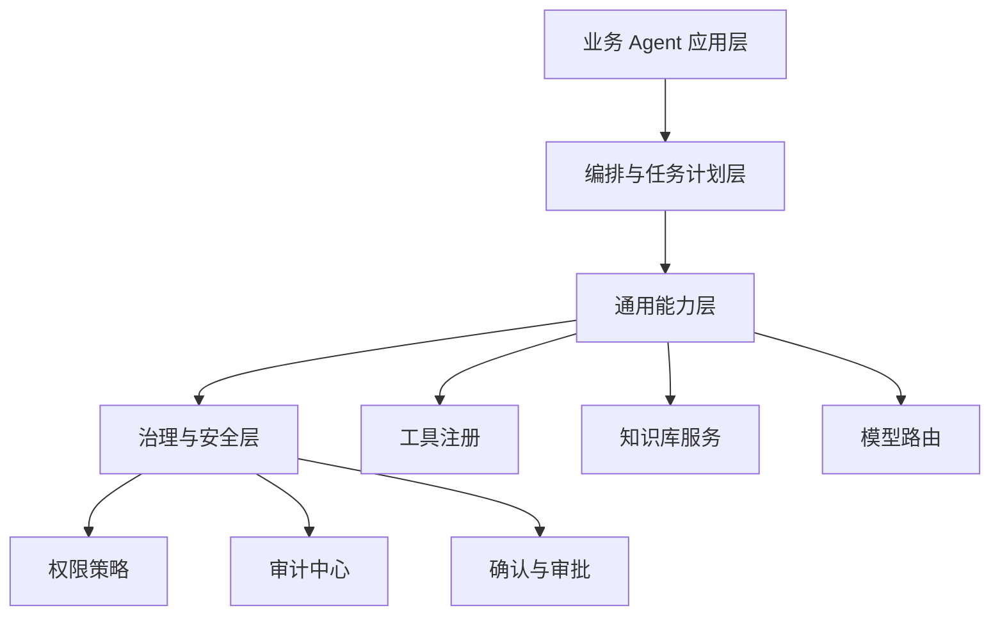

# E16 · 从项目到平台：企业 Agent 的演进路线

一个企业 Agent 项目开始时，通常只是为了解决一个具体问题。

IMS Copilot 的起点可能是：让员工更方便地查询政策、查个人数据、完成常见流程。

但做着做着，你会发现很多能力不是 IMS 独有的：

- 用户权限；
- 工具注册；
- 知识库权限过滤；
- 审计链路；
- 模型路由；
- Human-in-the-Loop（HITL）；
- 流程状态管理。

当这些能力开始被多个业务域复用，项目就开始走向平台。

## 什么时候需要平台化

不是一开始就做平台。

平台化应该来自真实复用压力。

| 信号 | 含义 |
| --- | --- |
| 多个业务团队都要接 Agent | 需要统一接入规范 |
| 工具权限反复实现 | 需要工具注册和权限中心 |
| 审计口径不一致 | 需要统一审计事件模型 |
| 模型调用成本失控 | 需要模型路由和配额 |
| 知识库越来越多 | 需要统一文档治理和检索策略 |

没有这些信号时，先把项目做好。

出现这些信号后，再抽平台能力。

## 平台化的四层

IMS Copilot 可以按四层演进：

业务 Agent 应用层可以有 IMS Copilot、HR Copilot、Finance Copilot。

底下的能力层和治理层应该尽量复用。

## 不要把平台做成大 Prompt

平台化不是把更多说明塞进系统 Prompt。

真正要平台化的是运行时能力：

- 工具怎么注册；
- 权限怎么校验；
- 知识库怎么过滤；
- 审计怎么记录；
- 模型怎么路由；
- 高风险动作怎么确认；
- 流程状态怎么保存。

Prompt 只是使用这些能力的说明书，不是平台本身。

## 演进路线

比较稳的路线是：

1. 先把 IMS Copilot 做成可上线项目；
2. 抽出统一工具注册和权限校验；
3. 抽出知识库检索与引用服务；
4. 抽出 Human-in-the-Loop（HITL）和流程状态服务；
5. 抽出审计中心和模型路由；
6. 支持更多业务 Copilot 接入。

每一步都应该来自已经发生的重复，而不是预先猜测未来会需要什么。

## 这一篇的结论

企业 Agent 的平台化，不是从第一天开始设计一个大平台。

它应该从一个真实项目里长出来。

IMS Copilot 的正确演进路径是：先解决真实业务问题，再把稳定复用的权限、工具、知识库、审计、模型路由和 Human-in-the-Loop（HITL）能力沉淀成平台。

这样平台才有根，不会变成空架构。
