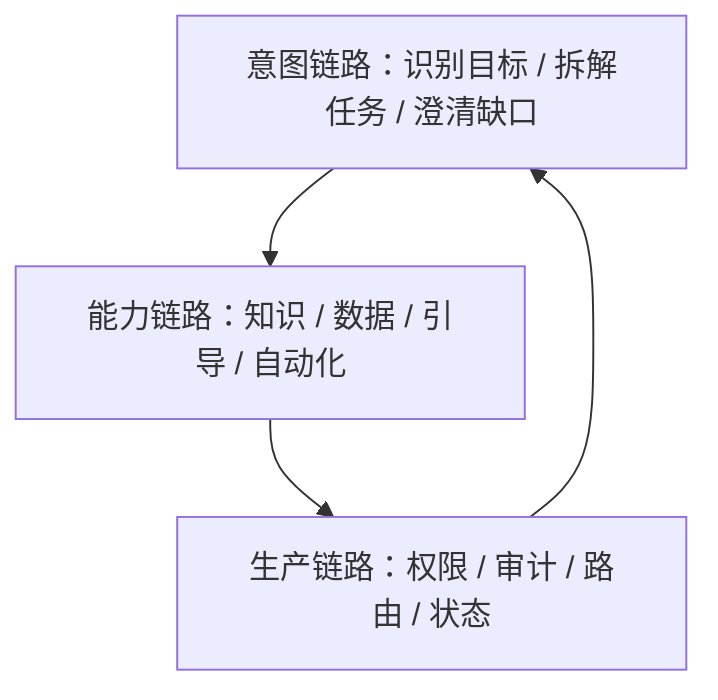

# E17 · 复盘：IMS Copilot 给企业 Agent 的设计启发

这套专栏从一个问题开始：

> 为什么通用 Agent 框架不能直接变成企业 Agent？

走到这里，答案已经很清楚。

企业 Agent 不是“接几个工具的聊天机器人”，而是在企业权限、数据、流程和审计约束下，帮助用户推进真实业务任务的系统。

## 四类能力

IMS Copilot 的主线能力可以压缩成四类：

| 能力 | 核心价值 |
| --- | --- |
| Policy Q&A | 让制度和流程可查询、可引用、可追溯 |
| 个人数据 | 在用户授权范围内查询自己的业务状态 |
| 操作引导 | 根据当前上下文告诉用户下一步怎么做 |
| 流程自动化 | 在确认和审计边界内替用户推进流程 |

这四类能力不是并列堆叠，而是逐步增强：

知识回答解决“我该知道什么”。

个人数据解决“我现在是什么状态”。

操作引导解决“我下一步怎么做”。

流程自动化解决“能不能帮我推进”。

## 四个约束

企业 Agent 的底座仍然是 E00 里的四个约束：

- 权限边界；
- 数据隔离；
- 审计要求；
- 组织流程适配。

任何能力只要越过这四条线，都不能上线。

## 三条链路

IMS Copilot 的架构可以压缩成三条链路：

意图链路决定系统有没有理解用户。

能力链路决定系统能不能完成任务。

生产链路决定系统能不能安全上线。

少任何一条，企业 Agent 都不完整。

## 一张检查表

如果你要把这套方法迁移到另一个企业 Agent 项目，可以先问十个问题：

| 问题 | 目的 |
| --- | --- |
| 用户真正要完成什么任务 | 避免只做聊天 |
| 涉及哪些能力类型 | 拆出知识、数据、引导、自动化 |
| 当前用户是谁 | 建立身份边界 |
| 能访问哪些数据 | 建立权限和隔离 |
| 哪些动作有副作用 | 找到 Human-in-the-Loop（HITL）节点 |
| 哪些系统需要接入 | 定义工具和流程边界 |
| 答案依据从哪里来 | 建立引用溯源 |
| 失败后怎么恢复 | 建立状态和补偿 |
| 成本和延迟是否可控 | 建立模型路由 |
| 出问题能否追踪 | 建立审计链路 |

这张表比任何框架选型都重要。

## 最后一个判断

企业 Agent 的难点，不是让模型“更聪明”。

真正的难点是：让模型在企业系统里有边界地发挥作用。

IMS Copilot 的启发是：

- 不要从工具开始，从任务开始；
- 不要从 Prompt 开始，从权限和数据结构开始；
- 不要从自动化开始，从可解释的操作引导开始；
- 不要从平台开始，从一个真实项目沉淀复用能力开始。

做到这些，企业 Agent 才不是 Demo，而是可以进入生产系统的工程能力。
